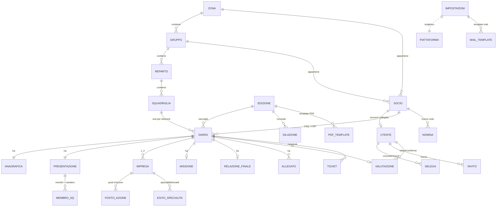
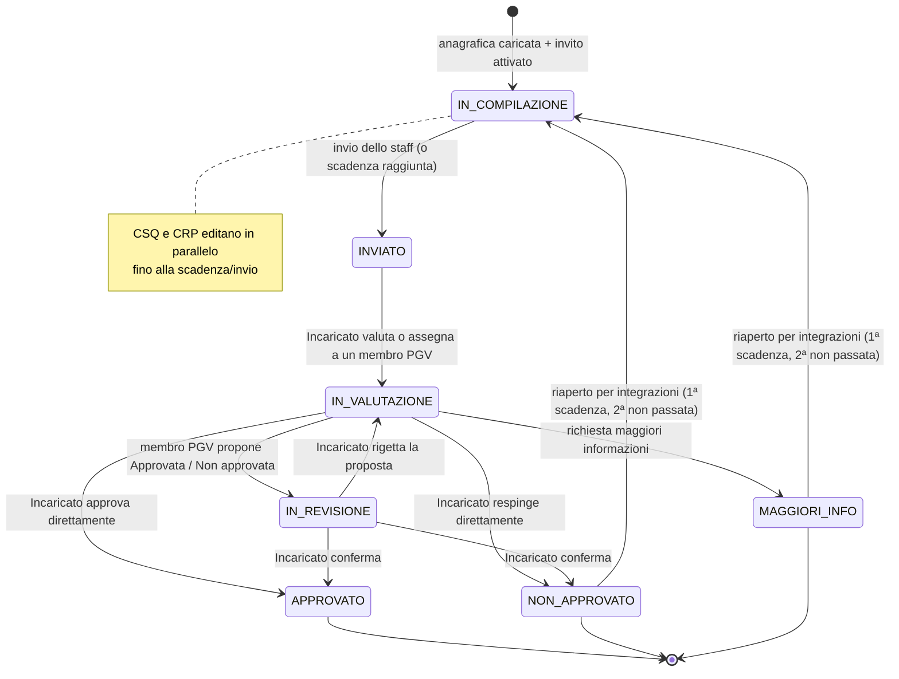

# Plancia — Piattaforma di gestione dei Guidoncini Verdi
### Documento di progettazione · AGESCI Campania · Branca E/G

> Documento di **architettura e progettazione**, non di implementazione.
> Fissa scelte, modello dati, regole di workflow e i punti tecnici "spinosi"
> prima di scrivere codice.

---

## 0. Il nome

Nome scelto: **Plancia**. La plancia di comando è il luogo da cui si governa la rotta e dove si
custodiscono il *Diario di Bordo* e la *bussola* — si affianca naturalmente a
`bussola.agescicampania.org` come strumento "sorella". Dominio suggerito:
`plancia.agescicampania.org` (o sottosezione di `bussola`).

*(Alternative valutate e scartate: Verdiario, Rotta Verde, Sentiero.)*

---

## 1. Glossario e dominio

| Termine | Significato |
|---|---|
| **Edizione** | Una annata dei Guidoncini Verdi. Contiene scadenze, data evento, cartelle Drive, anagrafiche. |
| **Diario** | Il "Diario di Bordo" di una Squadriglia per una Edizione. Oggetto centrale del workflow. |
| **Squadriglia / Reparto / Gruppo / Zona** | Gerarchia organizzativa (Zona → Gruppo → Reparto → Squadriglia). |
| **Specialità** | La specialità di squadriglia richiesta; può essere *Nuovo* o *Rinnovo*. |
| **CSQ** | Capo Squadriglia — compila il Diario. |
| **CRP** | Capo Reparto — edita le parti del Diario e compila la Relazione finale. |
| **Segreteria** | Segreteria regionale — setup edizioni, anagrafiche, inviti, dilazioni. |
| **Incaricati EG (IABR EG)** | Incaricati regionali E/G — tutto ciò che fa la segreteria + valutazione, conferma, pubblicazione. Possono modificare ogni decisione fino alla pubblicazione. |
| **PGV** | **Pattuglia Guidoncini Verdi** — i suoi membri valutano i diari **loro assegnati** (proposta da confermare). |

---

## 2. Attori e ruoli

Sei ruoli, gerarchici ma con permessi puntuali (non solo "livelli"):

- **Admin** — può tutto. Gestione utenti, edizioni, configurazioni, override.
- **Segreteria regionale** — setup edizioni, caricamento anagrafiche, invio/reinvio inviti,
  dilazioni, gestione helpdesk. *Non* valuta.
- **Incaricati EG regionali (IABR EG)** — tutto quanto fa la segreteria **+** valutazione, conferma
  delle proposte dei membri PGV, **modifica di qualunque decisione fino alla pubblicazione**,
  pubblicazione esiti, delega di diari ai membri della PGV. Possono **delegare** i loro accessi.
- **Membri PGV** — esprimono *proposte* di valutazione **solo sui diari loro assegnati**; le proposte
  di *Approvata*/*Non approvata* non sono mai definitive senza conferma dell'Incaricato.
  **Non possono delegare ad altri** i diari ricevuti.
- **CRP** — sul proprio reparto: editano i moduli del Diario e compilano la Relazione finale.
- **CSQ** — sulla propria squadriglia: compilano i moduli del Diario.

**Deleghe.** Segreteria e Incaricati possono *delegare* funzioni. Modello: una
`Delega(delegante, delegato, ambito, scadenza)` che concede temporaneamente un sottoinsieme di
permessi, tracciata e revocabile. **I membri PGV sono esclusi dal meccanismo di delega** (non possono
ri-delegare i diari assegnati).

### Creazione e nomina dei ruoli

Ogni ruolo richiede una **categoria di Socio** e ha una **autorità di creazione/nomina** precise.

| Ruolo | Categoria Socio richiesta | Creato / nominato da |
|---|---|---|
| **Admin** | nessun vincolo (può non avere Socio) | altri **Admin** + `createsuperuser` di Django |
| **Segreteria** | **capo** | Admin |
| **Incaricati EG (IABR)** | **capo** | Admin o Segreteria |
| **PGV** | **capo** | Admin, Segreteria, IABR |
| **CRP** | **capo** | Admin, Segreteria, IABR |
| **CSQ** | **ragazzo** | Admin, Segreteria, IABR |

Regole:
- Un **capo** può anche essere Admin; gli **Admin non devono** necessariamente essere capi o ragazzi
  (account "di servizio" senza `Socio` collegato).
- I ruoli **PGV/CRP** si assegnano solo a *capi*; **CSQ** solo a *ragazzi* (vincolo validato).
- Il trio **Admin/Segreteria/IABR** può nominare qualunque capo/ragazzo ai ruoli operativi,
  rispettando i vincoli di categoria.
- Ogni nomina è tracciata (`Nomina`: chi, chi nomina, ruolo, quando) per l'audit.

### Impersonazione (Admin / Segreteria)

**Admin** e **Segreteria** possono **impersonare** altri utenti per assistenza/diagnosi. Vincolo (sul
modello *Dashboard Zona*): si può impersonare solo un utente con **rango ≤ al proprio** — quindi la
Segreteria **non può** impersonare un Admin. Ranghi:

`ADMIN (100) > SEGRETERIA (80) > IABR (60) > PGV (40) > CRP (30) > CSQ (20)`

Realizzata con **django-hijack** e un `HIJACK_AUTHORIZATION_CHECK` custom che applica:
*impersonatore ∈ {Admin, Segreteria}*, *rango(target) ≤ rango(impersonatore)*, *target ≠ sé stesso*.
Ogni sessione di impersonazione è **loggata** (chi, chi, quando, durata) ed è mostrato un **banner**
persistente; l'azione di "ritorno" ripristina l'utente originale. *(Nota: la regola "≤" consente
l'impersonazione tra pari ruolo; restringibile a "<" se si preferisce.)*

### Matrice permessi (sintesi)

| Azione | Admin | Segreteria | Incaricati EG | PGV | CRP | CSQ |
|---|:--:|:--:|:--:|:--:|:--:|:--:|
| Crea/configura Edizione (Drive, date, evento) | ✓ | ✓ | ✓ | – | – | – |
| Carica anagrafiche (punto 1) | ✓ | ✓ | ✓ | – | – | – |
| Invia / reinvia inviti (CSQ, CRP, PGV) | ✓ | ✓ | ✓ | – | – | – |
| Concede dilazioni motivate | ✓ | ✓ | ✓ | – | – | – |
| Edita anagrafica (tutto, incl. CRP) | ✓ | ✓ | ✓ | – | – | – |
| Edita anagrafica (tutto **tranne** nome/cognome/mail CRP) | ✓ | ✓ | ✓ | – | ✓ | ✓ |
| Compila/edita moduli 2–5 (fino alla scadenza) | ✓ | – | – | – | ✓ | ✓ |
| Compila Relazione finale CRP (dopo completamento CSQ) | ✓ | – | – | – | ✓ | – |
| Valuta direttamente un diario | ✓ | – | ✓ | – | – | – |
| Propone valutazione su diario assegnato | ✓ | – | ✓ | ✓ (assegnati) | – | – |
| Conferma proposta di un membro PGV | ✓ | – | ✓ | – | – | – |
| Modifica una decisione fino alla pubblicazione | ✓ | – | ✓ | – | – | – |
| Pubblica esiti | ✓ | – | ✓ | – | – | – |
| Vede esito del proprio diario | ✓ | ✓ | ✓ | – | ✓ *solo se pubblicato* | ✓ *solo se pubblicato* |
| Gestione helpdesk | ✓ | ✓ | ✓ | – | – | – |
| Apre ticket helpdesk | – | – | – | – | ✓ | ✓ |

---

## 3. Architettura tecnica

### Stack (versioni richieste)

- **Python ≥ 3.14** (ultima patch disponibile).
- **Django ≥ 6.0** — *l'ultima stabile, ad oggi 6.0.5 (mag 2026); Django 6.0 supporta Python fino al
  3.14*. Sfrutta novità native utili al progetto: **Background Tasks** e supporto **CSP** integrato.
- **PostgreSQL ≥ 17** (ultima patch della serie più recente disponibile).

### Componenti aggiuntivi — **tutti inclusi** (non più "consigliati")

- **Celery + Redis** — job asincroni: invio massivo inviti/notifiche, generazione PDF/Excel, upload
  su Drive, statistiche di chiusura, replay della coda di sync offline.
- **WeasyPrint** — generazione PDF da template HTML/CSS (layout funzionale).
- **openpyxl** — generazione Excel.
- **django-fsm-2** (o `viewflow.fsm`) — macchina a stati di Diario e Valutazione con guardie di
  permesso sulle transizioni.
- **django-guardian** — permessi object-level per lo scoping zona/gruppo/reparto/squadriglia.
- **django-axes** — protezione brute-force, complementare al log sessioni di allauth.
- **Editor rich text** — **django-tinymce** per la modifica dei template email in Impostazioni (§15).
- **django-hijack** — impersonazione utenti (Admin/Segreteria), con check di autorizzazione per rango
  (§2) e audit.
- **django-allauth** — autenticazione, social (Google/Apple/Microsoft), MFA, log sessioni.
- **django-pwa** — base PWA; l'offline-with-sync è costruito sopra (§9).
- **Bootstrap 5** — frontend responsive.
- **Google Drive API** — archiviazione file (foto, PDF, Excel) nelle cartelle d'edizione, via **OAuth**.

### Suddivisione in app Django

```
plancia/
├─ accounts/        # utente custom, ruoli, deleghe, MFA, audit login
├─ org/             # Zona, Gruppo, Reparto, Squadriglia
├─ editions/        # Edizione, scadenze, cartelle Drive, dilazioni
├─ diaries/         # Diario, moduli (anagrafica, imprese, missione, relazione), FSM
├─ evaluations/     # Valutazione, assegnazioni PGV, conferme, pubblicazione
├─ notifications/   # astrazione canali (email; WhatsApp in seconda fase), inviti, template
├─ storage_drive/   # client Google Drive (OAuth), upload, mapping file↔record
├─ exports/         # generazione PDF ed Excel
├─ helpdesk/        # ticket verso segreteria/incaricati
└─ stats/           # statistiche di chiusura edizione
```

---

## 4. Modello dati



### Entità principali

**`Utente`** (custom, `AbstractUser`): `email` come username, `ruolo` di base, collegamento alla
gerarchia org, flag `mfa_obbligatoria`. Collegato 1:1 a un `Socio` all'attivazione dell'account.

**`Socio`** (anagrafica persone — vedi §14): `codice_socio` (**solo numerico, 4–8 cifre, univoco**:
identificativo di piattaforma), `nome`, `cognome`, FK `gruppo`, FK `zona`, `email`,
`categoria` (`capo`/`ragazzo`). Da questa entità si selezionano i ruoli (CRP, IABR EG, PGV dai
*capi*; CSQ dai *ragazzi*). Campi accessori opzionali da import: `cellulare`, `branca`, `sesso`,
`data_nascita`, `livello_foca`, `status`.
- **Regola email**: l'email di un *capo* non è modificabile dal capo stesso (solo Segreteria, Admin,
  IABR EG); l'email di un *ragazzo* (CSQ) è aggiunta dall'import Evento ed è modificabile dal ragazzo
  (oltre che da Segreteria/Admin/IABR).

**`Impostazioni`** (singleton, **solo Admin** — vedi §15): titolo, sottotitolo, parametri SMTP,
`manutenzione`, `debug_toolbar` (visibile ai soli admin), `debug_diagnostico` (logging verboso),
`email_mode` (`reale`/`simulato`/`simulato_piu_invio`), cartella log email. *(Il `DEBUG` reale è
governato da variabile d'ambiente — vedi §15.)*

**`Nomina`**: FK `socio`/`utente`, `ruolo`, `nominato_da`, `creato_at`, eventuale `edizione` per i
ruoli contestuali. Valida i vincoli di categoria (capo/ragazzo) e l'autorità di chi nomina (§2).

**`MailTemplate`**: `chiave` (es. `invito_csq`, `invito_crp`, `invito_pgv`, `esito_pubblicato`,
`dilazione`, `richiesta_info`), `oggetto`, `corpo_html` (rich text), `attivo`. I **tag** ammessi per
ciascuna chiave sono in un registro (§15) e mostrati all'admin nell'editor.

**`PdfTemplate`**: `chiave` (es. `diario`), `contenuto_html` (template WeasyPrint), `versione`,
`attivo`. Scaricabile e caricabile da Impostazioni (§15); se assente si usa il default su file.

**`LogImportazione`** + **`RigaImportazione`**: ogni import (Co.Ca./ragazzi/Evento) produce un log
(file, autore, totali ok/scartati/da-riconciliare) e le righe con `stato_match` e `socio_match`
(nullable), su cui agisce la **schermata di riconciliazione manuale** (§14).

**`Edizione`**: `anno`, `stato` (`bozza`/`aperta`/`in_valutazione`/`chiusa`),
`scadenza_evento` (prima — consegna in presenza), `scadenza_assemblea` (seconda — assemblea
regionale), `data_evento`, `drive_folder_foto_id`, `drive_folder_output_id`, `drive_oauth_account`.

**`Diario`**: FK `edizione`, FK `squadriglia`, FK `csq` (Socio ragazzo), FK `crp` (Socio capo),
`tipo` (`nuovo`/`rinnovo`), `stato` (FSM, §6), `scadenza_riferimento` (`prima`/`seconda`),
`pubblicato_at` (null finché non pubblicato), `csq_completato_at`, `inviato_at`.

**`Anagrafica`** (1:1): tutti i campi del punto 1, popolati dall'import Evento (§14). Il CSQ è
identificato dal **codice socio**; il CRP dai **campi referente**. `crp_nome`, `crp_cognome`,
`crp_email` sono **read-only per il CSQ**; l'email del CRP (capo) non è modificabile neppure dal CRP
(solo Segreteria/Admin/IABR).

**`Presentazione`** (1:1) + **`MembroSq`** (N): ruolo, nome, sentiero; campo "Cosa sappiamo fare".

**`Impresa`** (N, `numero` ∈ {1,2}): `titolo`, `data_inizio`, `data_fine`, `perche`, `come`, `cosa`,
**`link_esterno`** (URL opzionale a video/materiale), `PostoAzione`, `EsitoSpecialita`
(stato `conquistata`/`non_conquistata`/`in_cammino`).

**`Missione`** (0/1): `titolo`, `data`, `descrizione_svolgimento`, posti d'azione, esiti.

**`RelazioneFinale`** (0/1): sintesi 1ª/2ª impresa, sintesi missione, considerazioni finali,
`specialita_conquistata` (Sì/No). Compilabile dal CRP **solo dopo** che la parte CSQ è completa.

**`Allegato`**: FK Diario + modulo, `tipo` (`foto`), `drive_file_id`, `nome`, `mime`, `dimensione`,
`caricato_da`, `stato_sync` (`locale`/`in_coda`/`caricato`).

**`Valutazione`** (0/1): `esito` (`approvata`/`maggiori_info`/`non_approvata`),
`stato` (`assegnata`/`in_revisione`/`confermata`), `valutatore` (Incaricato o membro PGV),
`confermata_da`, `note`, timestamp.

**`Invito`**: destinatario, `ruolo_target` (CSQ/CRP/PGV), `token`, `canali` (`email`; `whatsapp` in
2ª fase), `stato`, `inviato_at`, `attivato_at`.

**`Delega`**, **`Dilazione`** (nuova scadenza, motivazione, concessa_da), **`Ticket`** (helpdesk),
**`LoginEvent`** (audit sessioni: utente, ip, user-agent, esito, provider social).

---

## 5. Moduli del Diario: compilazione, visibilità, obbligatorietà

**Editing aperto e collaborativo.** Fino alla **scadenza** (o all'invio dello staff), il Diario può
essere modificato **sia dai CSQ sia dai CRP**: non c'è più una sequenza rigida CSQ→CRP. La Relazione
finale del CRP resta vincolata al completamento della parte CSQ.

| # | Modulo | Compila / edita | Obbligatorio | Foto | Note |
|---|---|---|---|:--:|---|
| 1 | Anagrafica | Segr./Inc. (init); CSQ e CRP (edit) | sì | – | CSQ/CRP editano tutto **tranne** nome/cognome/mail CRP |
| 2 | Presentazione squadriglia | CSQ / CRP | sì | – | membri + sentiero + "cosa sappiamo fare" |
| 3 | 1ª Impresa | CSQ / CRP | **sempre** | sì | + campo **link esterno** |
| 4 | 2ª Impresa | CSQ / CRP | se **Nuovo**: sì · se **Rinnovo**: **facoltativa** | sì | in caso di Rinnovo è **visibile e compilabile a scelta del CSQ** |
| 5 | Missione | CSQ / CRP | se **Nuovo**: sì · se **Rinnovo**: **facoltativa** | sì | come sopra |
| 6 | Relazione finale CRP | CRP | sì (dopo CSQ) | – | **mai** visibile al CSQ |
| – | Valutazione | Incaricati / PGV | – | – | **mai** visibile a CSQ/CRP fino a pubblicazione |

**Nota sul Rinnovo.** I moduli 4 e 5 **non sono nascosti** in caso di Rinnovo: restano visibili e
compilabili, ma **non obbligatori**. È il CSQ a decidere se valorizzarli. La validazione di
"completezza" del diario li considera obbligatori solo se `tipo == nuovo`.

**Visibilità ancora protetta a tre livelli** (UI + view + serializer) per ciò che resta riservato:
la **Relazione finale CRP** e la **Valutazione** non sono mai visibili al CSQ; la valutazione non è
visibile a CSQ/CRP fino alla pubblicazione.

---

## 6. Macchina a stati del Diario e regole di valutazione



### Regole esplicite

1. **Compilazione collaborativa.** In `IN_COMPILAZIONE`, CSQ e CRP editano in parallelo fino alla
   scadenza o all'invio dello staff. La Relazione finale CRP è abilitata solo quando i moduli CSQ
   obbligatori (in base a Nuovo/Rinnovo) sono completi.
2. **Valutazione diretta vs assegnata.**
   - **Incaricato EG** che valuta direttamente → esito definitivo
     (`APPROVATO`/`NON_APPROVATO`/`MAGGIORI_INFO`).
   - **Membro PGV** su diario assegnato → *proposta*. Per *Approvata* e *Non approvata* il diario
     passa per **`IN_REVISIONE`** e richiede **conferma** dell'Incaricato.
3. **`IN_REVISIONE` solo per Approvata/Non approvata.** *Maggiori informazioni richieste* **non**
   passa per `IN_REVISIONE`: prevede già un ulteriore passaggio proprio (la riapertura per
   integrazioni), quindi non necessita di conferma separata.
4. **Gli Incaricati possono modificare qualunque decisione fino alla pubblicazione.** Finché l'esito
   non è pubblicato, un Incaricato può cambiarlo (es. `APPROVATO` → `NON_APPROVATO`, o riportarlo
   `IN_VALUTAZIONE`). Ogni modifica è tracciata nell'audit.
5. **Riapertura per integrazioni.** Un diario *non accettato* (`NON_APPROVATO` o `MAGGIORI_INFO`) può
   essere **riaperto** e torna in `IN_COMPILAZIONE` **solo se**: la valutazione è relativa alla
   **prima** scadenza **e** la **seconda** non è ancora passata. Lo storico è conservato.
6. **Pubblicazione.** Gate separato dal workflow: l'esito **non è visibile** a CSQ/CRP finché un
   Incaricato non lo **pubblica** (`pubblicato_at`). Granularità della pubblicazione: **tutti i diari**,
   oppure **solo quelli valutati alla data di una scadenza** (round). Modellata come timestamp,
   applicabile a diari in stati diversi.

---

## 7. Ciclo di vita dell'Edizione

1. **Setup** (Segreteria/Incaricati): nuova `Edizione` con cartelle Drive (foto + output, via OAuth),
   due scadenze (`scadenza_evento`, `scadenza_assemblea`), `data_evento`, import anagrafiche
   (CSV/Excel → genera i Diari in `IN_COMPILAZIONE` con punto 1 precompilato).
2. **Inviti**: a CSQ e CRP per attivare account ed editare. Reinvio successivo, anche a singoli o
   sottoinsiemi (§8).
3. **Compilazione collaborativa**: CSQ e CRP editano in parallelo fino alla scadenza; Relazione
   finale CRP dopo completamento CSQ; invio staff. Autosalvataggio e resilienza offline (§9).
4. **Scadenze tassative** con **dilazioni motivate** concedibili per singolo diario/squadriglia.
5. **Valutazione** (§6): assegnazione ai membri PGV, conferme, modifiche fino a pubblicazione,
   riaperture.
6. **Pubblicazione** esiti (tutti o per round di scadenza).
7. **Chiusura e archiviazione (retention).** A edizione **chiusa** si esegue l'**archiviazione**: la
   piattaforma genera/garantisce su Drive **tutti i PDF dei diari** e l'**Excel degli esiti**, poi
   consente di **ripulire la piattaforma** dai dati pesanti (foto caricate; i link esterni a
   video/risorse restano come riferimento testuale). Comando `archivia_edizione` idempotente, in due
   passi (`--genera` poi `--purga`) con conferma esplicita. Vedi §12.
8. **Statistiche**: accettazioni/rifiuti con **aggregazione per zona**, **tempi di compilazione**,
   **difficoltà segnalate** (dai ticket helpdesk). Export complessivo.

---

## 8. Inviti e notifiche

Astrazione `Notifier` con canali plug-in.

- **Fase 1 — solo email.** Invio/reinvio inviti con token di attivazione, a singoli o batch (job
  Celery). Template distinti per CSQ/CRP/PGV.
- **Fase 2 — WhatsApp (da valutare in seguito).** L'adapter resta predisposto dietro `Notifier`.
  L'invio programmatico business-initiated richiede **WhatsApp Business Cloud API** (Meta) con account
  verificato e **template approvati**, con costi per conversazione; in alternativa un fallback
  `wa.me` semi-automatico. Decisione e attivazione rimandate.

---

## 9. PWA, offline e sincronizzazione

Scope **confermato**: **"resilienza della bozza + sync alla riconnessione"** (non offline multi-giorno
garantito). `django-pwa` fornisce manifest + service worker di base; sopra costruiamo:

1. **App shell + form module in cache** (Cache API).
2. **Autosalvataggio bozza in IndexedDB** (es. `localForage`/`Dexie`) a ogni modifica: non si perde
   lavoro se cade la connessione, anche su browser senza Background Sync.
3. **Coda di invio offline**: i POST falliti per assenza di rete vengono accodati e ritrasmessi alla
   riconnessione (Background Sync dove disponibile; altrimenti replay alla riapertura).
4. **Foto offline**: salvate come Blob in IndexedDB, **ridimensionate lato client** prima dello
   storage, caricate su Drive (via backend) alla riconnessione; `Allegato.stato_sync` traccia lo stato.
5. **Conflitti**: concorrenza ottimistica con `version` + `updated_at` per modulo; last-write-wins per
   campo con storico. *Nota:* con l'editing collaborativo CSQ↔CRP (§5) i conflitti diventano possibili
   anche online → questa strategia per-campo serve a entrambi gli scenari.

*Caveat onesto (iOS/Safari):* niente Background Sync ed eviction della cache dopo ~7 giorni → coerente
con lo scope scelto (resilienza, non disconnessione prolungata).

---

## 10. Integrazione Google Drive (OAuth)

- **Autenticazione: OAuth** di un account Workspace della regione (scope `drive.file`).
  Token e refresh-token cifrati a riposo; flusso di consenso in fase di setup edizione.
- Upload nelle **cartelle indicate per edizione** (`drive_folder_foto_id`, `drive_folder_output_id`).
- Su Drive vanno: foto dei CSQ, **PDF** del Diario, **Excel** complessivo. Ogni file ha un record
  locale con `drive_file_id` per tracciabilità e rigenerazione.
- Upload **asincrono** via Celery con retry (specie dopo la sync offline).
- *Da confermare:* quale account Workspace regionale ospita l'OAuth e dove risiedono le cartelle
  (Drive personale vs Shared Drive — preferibile **Shared Drive** per continuità in caso di cambio
  referente).

---

## 11. Generazione PDF ed Excel

- **PDF** (per diario): template HTML/CSS → **WeasyPrint**. Layout *funzionale*: copertina con
  anagrafica, sezioni Presentazione/Imprese/Missione/Relazione, foto incorporate, esiti specialità.
  Generato on-demand e/o all'invio; copia su Drive.
- **Excel** (per edizione): **openpyxl**, un foglio riepilogo con **una riga per diario** e tutte le
  risposte appiattite (anagrafica, esiti, valutazione, tempi), più fogli per zona.
- Entrambi in job Celery, salvati su Drive e linkati al record d'edizione.

---

## 12. Sicurezza e tutela dei dati (la piattaforma tratta dati sensibili)

**Premessa.** Plancia tratta dati personali di **minori** (i membri delle squadriglie sono
tipicamente E/G, 12–16 anni) e **foto** che li ritraggono: categoria ad alto rischio sotto GDPR.
La tutela è un requisito di progetto, non un'aggiunta.

**Misure tecniche**

- **Cifratura in transito** (TLS ovunque, HSTS) e **a riposo**: DB con cifratura del volume, campi
  particolarmente sensibili cifrati a livello applicativo, token OAuth Drive cifrati.
- **CSP nativo** di Django 6.0 + header di sicurezza (`SECURE_*`, cookie `Secure`/`HttpOnly`/`SameSite`).
- **MFA** (`allauth.mfa`, TOTP + recovery): **obbligatoria** per ruoli privilegiati (Admin,
  Segreteria, Incaricati EG); opzionale per CSQ/CRP/PGV (il login social delega la 2FA all'IdP).
- **Social login** (Google, Apple, Microsoft) via allauth.
  - *Apple ("Sign in with Apple")*: Service ID, key, return URL; il nome arriva **solo al primo**
    login e l'email può essere un relay privato → gestire nel mapping account.
  - *Microsoft*: provider Azure AD, attenzione single-tenant vs multi-tenant.
- **Log delle sessioni** (`LoginEvent` dai signal allauth: login/logout/fallimenti, provider, IP,
  user-agent) + **django-axes** per rate-limit/brute-force.
- **Permessi**: RBAC + object-level (**django-guardian**) — CSQ/CRP vedono solo i propri oggetti, i
  membri PGV solo gli assegnati (e non possono ri-delegare), gli Incaricati la regione. Le deleghe
  sono tracciate e a scadenza.
- **Audit trail** su transizioni di stato del Diario e su valutazioni/modifiche (chi/quando/cosa),
  essenziale per riaperture e per la modifica delle decisioni fino a pubblicazione.
- **Minimizzazione**: caricare in anagrafica solo i dati necessari; evitare dati non indispensabili.

**Misure organizzative / conformità**

- **Base giuridica e informativa** per il trattamento dei dati dei minori (consenso dei
  genitori/tutori già gestito a livello associativo: verificare la copertura per la pubblicazione su
  piattaforma e per le foto).
- **DPA con Google** per l'uso di Drive come responsabile del trattamento; preferire **Shared Drive**
  regionale.
- **Data retention per edizione**: a edizione chiusa, **archiviazione** dei PDF dei diari e
  dell'Excel esiti su Drive, poi **purge** dei dati pesanti dalla piattaforma (foto eliminate; i link
  esterni restano come testo). Procedura in due passi (`archivia_edizione --genera`/`--purga`) con
  conferma, coerente con la minimizzazione GDPR. La cancellazione è loggata.
- **Backup cifrati** e principio del **minimo privilegio** sugli accessi infrastrutturali.

---

## 13. Helpdesk e statistiche

- **Helpdesk**: ticket (oggetto, categoria, corpo, eventuale FK al Diario) verso segreteria/
  incaricati, con stati e assegnatario. La **categoria** alimenta la statistica "difficoltà segnalate".
- **Statistiche di chiusura edizione**: accettazioni/rifiuti/maggiori info con **aggregazione per zona**
  (e gruppo/reparto); **tempi di compilazione** (da `IN_COMPILAZIONE` a `INVIATO`); **difficoltà
  segnalate** (volume e categorie ticket). Export grafico + dati grezzi nell'Excel d'edizione.

---

## 14. Soci, anagrafiche e import dei tracciati

### Selezione di capi e ragazzi (autocompletamento)
Ovunque si debba selezionare **un capo o un ragazzo** (assegnazione CRP/CSQ, delega a un membro PGV,
nomina incaricati, ecc.) si usa una **casella con autocompletamento** che cerca per **nome, cognome,
zona, gruppo o codice socio**. Implementazione: un endpoint JSON `GET /api/soci/cerca?q=…` (filtrato
per permessi/ambito del richiedente) + widget lato client (es. Tom Select su Bootstrap). I risultati
mostrano `Cognome Nome — Gruppo (Zona) · #codice_socio`. Nei `ModelForm` dell'admin si usano gli
`autocomplete_fields`.

### Le tre sorgenti di import

| Tracciato | File esempio | Popola | Da cui si selezionano |
|---|---|---|---|
| **Capi (Co.Ca.)** | `coca_2026.csv` | `Socio(categoria=capo)` | tutti i ruoli **tranne** CSQ (CRP, IABR EG, PGV, segreteria) |
| **Ragazzi** | *(come Co.Ca. ma senza EMAIL)* | `Socio(categoria=ragazzo)` | **solo** CSQ |
| **Anagrafiche diari (Evento)** | `Evento24139.csv` | `Diario` + `Anagrafica` | collega CSQ e CRP, crea i diari |

**Co.Ca. (capi).** CSV con prima riga `sep=,`, valori protetti come `="…"` (da ripulire). Upsert per
**codice socio**. Campi usati: `CODICE SOCIO`, `NOME`, `COGNOME`, `EMAIL`, `CELLULARE`, `ZONA`,
`GRUPPO`, `BRANCA`, `STATUS SOCIO`. L'email del capo **non** sarà modificabile dal capo.

**Ragazzi.** Stesso tracciato dei capi **senza** la colonna `EMAIL`: i `Socio(ragazzo)` nascono senza
email. L'email viene **aggiunta dall'import Evento** (campo "Indirizzo mail capo squadriglia") e resta
**modificabile dal ragazzo**.

**Evento (anagrafiche diari).** CSV UTF-8 con BOM, separatore `;`. Mappatura (vedi Appendice D per il
dettaglio colonna per colonna):
- **CSQ** = `Codice` (codice socio) + `Cognome` + `Nome` → match/upsert su `Socio(ragazzo)`;
  email CSQ presa da **"Indirizzo mail capo squadriglia"**.
- **CRP** = campi **referente** (`NomeReferente` in formato "COGNOME, NOME", `EmailReferente`,
  `CellReferente`) → match su `Socio(capo)` per email (fallback su nome/cognome).
- Squadriglia/Reparto/Gruppo/Zona, `Specialità di squadriglia`.
- `tipo` = **rinnovo** se "È una riconferma?" = sì, altrimenti **nuovo**.
- `scadenza_riferimento`/partecipazione evento da "La squadriglia parteciperà all'Evento GV?".
- *(opzionale)* le descrizioni "prima/seconda impresa" e "tecniche" possono **preseminare** i
  rispettivi campi del Diario.

**Riconciliazione (punto di attenzione).** L'Evento identifica il CRP per **nome/email**, non per
codice socio; i capi hanno codice socio solo nel tracciato Co.Ca. L'import aggancia il referente a un
`Socio(capo)` **per email**; per le righe senza match (email assente o non trovata) apre una
**schermata di riconciliazione manuale dal log di importazione**, da cui l'operatore associa la riga
al capo corretto (con l'autocompletamento §14). Ogni import produce un `LogImportazione` con le righe
e il loro stato di match; nulla blocca l'intero file.

**Esecuzione.** Ogni import è un **task Celery** con report finale (righe ok / scartate / da
riconciliare), avviabile da UI (Segreteria/Incaricati/Admin) e come **management command**
(`import_coca`, `import_ragazzi`, `import_evento`). Gli import sono **idempotenti** (upsert per chiave).
*Nota privacy:* i file reali contengono dati di **minori** e dati sensibili → non vanno versionati né
inclusi in pacchetti distribuibili; nello scaffold ci sono solo **esempi sintetici**.

---

## 15. Impostazioni di piattaforma (solo Admin)

Pagina di impostazioni riservata agli **amministratori** (entità `Impostazioni`, singleton), sul
modello della *Dashboard Zona*. Permette di configurare:

- **Identità**: `titolo` e `sottotitolo` della piattaforma (usati in header, `<title>`, email).
- **Mail (SMTP)**: host, porta, utente, password (cifrata a riposo), TLS, mittente di default.
- **Modalità email** (`email_mode`):
  - `reale` — invio via SMTP;
  - `simulato` — **nessun invio**: ogni messaggio è scritto come file `.eml`/`.log` in una
    **cartella di log dedicata** (`logs/email/`);
  - `simulato_piu_invio` — scrive il log **e** invia realmente.

  Realizzata con un **email backend custom** che legge `email_mode` da `Impostazioni` e compone il
  backend su file (per il log) con quello SMTP (per l'invio).
- **Template email** *(rich text)*: editor WYSIWYG per modificare `oggetto` e `corpo_html` dei
  template predefiniti (`invito_csq`, `invito_crp`, `invito_pgv`, `esito_pubblicato`, `dilazione`,
  `richiesta_info`, …). Per ciascun template viene mostrato l'elenco dei **tag** disponibili
  (placeholder) che verranno sostituiti all'invio. Esempi di tag:
  `{{ nome }}`, `{{ cognome }}`, `{{ titolo_piattaforma }}`, `{{ link_attivazione }}`,
  `{{ edizione }}`, `{{ squadriglia }}`, `{{ scadenza }}`, `{{ esito }}`, `{{ note }}`,
  `{{ nuova_scadenza }}`, `{{ motivazione }}`. Il rendering usa il template engine con un **contesto
  ristretto** ai soli tag previsti per quella chiave.
- **Template PDF (WeasyPrint)**: l'admin può **scaricare** il template HTML attivo (o il default come
  punto di partenza) e **caricarne** uno personalizzato; la generazione PDF usa quello attivo. Il
  template è un HTML/CSS con un contesto documentato (`{{ diario }}`, anagrafica, imprese, missione,
  relazione, foto, esiti, `{{ titolo_piattaforma }}`).
- **Import dei tracciati**: dalla stessa pagina, **Admin, IABR e Segreteria** possono avviare gli
  import (Co.Ca./ragazzi/Evento — §14), con report di esito e riconciliazione.
- **Manutenzione**: flag `manutenzione` → un middleware mostra una pagina di cortesia a tutti
  **tranne** gli amministratori (che continuano a operare).
- **Diagnostica runtime**: `debug_toolbar` (visibile ai soli admin) e `debug_diagnostico` (alza la
  verbosità di logging). Mostra inoltre, in sola lettura, lo stato corrente del `DEBUG` d'ambiente.

**`DEBUG` reale (scelta confermata).** Il `DEBUG` di Django è governato dalla **variabile d'ambiente**
`DJANGO_DEBUG` in `.env.prod` e **richiede un redeploy/restart** per avere effetto (si legge
all'avvio). La pagina Impostazioni lo **mostra** ma non lo ribalta a runtime: per attivarlo si
modifica `.env.prod` e si riavviano i container. I flag in pagina restano per debug-toolbar e logging.

---

## 16. Deployment e DevOps

### Principio
Tutto dockerizzato **tranne il reverse proxy**, che è configurabile. Uno **script di configurazione
di produzione** genera l'ambiente, sceglie la **modalità di proxying** e la **porta** dell'app
(default **8000**) e rende il template vhost corretto.

### Ambiente di sviluppo
- Dipendenze gestite con **uv** (`pyproject.toml` + `uv.lock`).
- **PostgreSQL e Redis dockerizzati**; Django **non** in container: gira sull'host con **`uv run`**
  (loop di sviluppo rapido).
- Flusso tipico:
  ```bash
  docker compose -f docker-compose.dev.yml up -d db redis
  uv run manage.py migrate
  uv run manage.py runserver 0.0.0.0:8000
  uv run celery -A plancia worker -l info        # + beat se serve
  ```
- `.env.dev` con `DATABASE_URL` verso `localhost:5432` (porta del container pubblicata in dev).

### Ambiente di produzione (Docker Compose)
Servizi containerizzati:

- **`web`** — Django servito da **gunicorn** (worker uvicorn/sync). Porta interna 8000.
- **`worker`** — Celery worker.
- **`beat`** — Celery beat (schedulazioni: promemoria scadenze, generazioni periodiche…).
- **`db`** — PostgreSQL 17 (volume persistente).
- **`redis`** — broker/result backend Celery + cache.
- **`nginx`** — **opzionale**, presente solo nella modalità "proxy dockerizzato"
  (compose profile `proxy-nginx`).

**Static & media.** **WhiteNoise** serve gli static dall'app stessa: così un proxy *esterno* può
limitarsi al reverse proxy puro, senza accedere al filesystem dei container. Nella modalità nginx
dockerizzato, nginx può opzionalmente servire gli static da un volume condiviso per performance. I
media sono transitori (staging locale prima dell'upload su Drive).

**Settings Django per il proxy.** In tutte le modalità: `SECURE_PROXY_SSL_HEADER =
('HTTP_X_FORWARDED_PROTO', 'https')`, `USE_X_FORWARDED_HOST = True`, `ALLOWED_HOSTS` e
`CSRF_TRUSTED_ORIGINS` valorizzati dallo script di configurazione.

### Modalità di proxying (selezionabili dallo script)
1. **`nginx-docker`** — un container nginx nello stesso compose fa da reverse proxy verso `web:8000`
   e pubblica 80/443. TLS gestita qui (certificati montati o companion ACME).
2. **`nginx-host`** — nessun proxy in compose; l'app pubblica `${APP_PORT:-8000}` sull'host e un
   **nginx già installato** fa da reverse proxy. Si fornisce il **template vhost nginx** (Appendice A).
3. **`apache-host`** — come sopra ma con **Apache 2 esistente** (`mod_proxy`, `mod_proxy_http`,
   `mod_ssl`, `mod_headers`); si fornisce il **template vhost Apache** (Appendice B).

HTTPS è obbligatorio in ogni modalità (la PWA lo richiede); nelle modalità `*-host` la TLS termina
sul server esistente.

### Porta
Default **8000**, sovrascrivibile via `APP_PORT`. In `nginx-docker` la 8000 resta interna alla rete
del compose; nelle modalità `*-host` viene pubblicata sull'host e referenziata dal vhost.

### Script di configurazione di produzione — `configure-prod.sh`
Bash interattivo (con possibilità di flag), idempotente e ri-eseguibile. Tra le altre cose:

- raccoglie/accetta: `SERVER_NAME`, **modalità proxy** (`nginx-docker|nginx-host|apache-host`),
  **porta** (default 8000), opzione **TLS** (`letsencrypt|self-signed|external`), credenziali DB,
  `SECRET_KEY`, `ALLOWED_HOSTS`/`CSRF_TRUSTED_ORIGINS`, SMTP, client OAuth Google/Drive e social;
- genera **`.env.prod`** (creando i secret mancanti);
- imposta **`COMPOSE_PROFILES`** in base alla modalità (include/esclude il servizio `nginx`);
- **rende il template vhost** corretto sostituendo `SERVER_NAME` e `APP_PORT`; nelle modalità host lo
  scrive nella posizione attesa (`/etc/nginx/sites-available/…` o `/etc/apache2/sites-available/…`)
  lasciando l'abilitazione all'operatore;
- opzionalmente esegue `docker compose … up -d`, `migrate`, `collectstatic`.

*(Lo script può essere anche in Python via `uv run configure.py`; in bash resta privo di dipendenze
sul server.)*

### Backup periodico (cron)
Ripreso dalla *Dashboard Zona*: uno script `deploy/backup.sh` invocato da **cron** che esegue il
**dump del database** (`pg_dump` via `docker compose exec`), lo **comprime** (gzip), archivia i
**media e i log** (tar), copia l'`.env.prod`, applica una **retention** configurabile (default 30
giorni) e scrive tutto su un **file di log** con timestamp; al termine può inviare una **notifica
email** di esito. Esempio di pianificazione in `deploy/crontab.example` (Appendice E):

```cron
# Backup Plancia ogni notte alle 02:30
30 2 * * *  /srv/plancia/deploy/backup.sh >> /var/log/plancia_backup.log 2>&1
```

In alternativa, la stessa logica è schedulabile via **Celery beat**; il cron resta la via
consigliata perché indipendente dallo stato dei container applicativi.

---

## 17. Roadmap implementativa suggerita

1. **Fase 0 — fondamenta**: progetto Django 6 + Python 3.14 con **uv**; `org` + `accounts` (utente
   custom, ruoli); allauth con email/password e MFA per ruoli privilegiati; hardening sicurezza di
   base; **compose dev** (db + redis dockerizzati, Django via `uv run`) e **compose prod** con le tre
   modalità di proxying e lo **script `configure-prod.sh`** (§14).
2. **Fase 1 — edizioni & anagrafiche**: `editions`, import anagrafiche, generazione Diari, matrice
   permessi, scoping object-level (guardian).
3. **Fase 2 — compilazione Diario**: moduli 1–6 con editing collaborativo CSQ↔CRP, regole
   Nuovo/Rinnovo (4–5 facoltativi se Rinnovo), FSM fino a `INVIATO`, upload foto (online).
4. **Fase 3 — inviti & notifiche email** con token e reinvio batch (adapter WhatsApp come stub).
5. **Fase 4 — valutazione**: assegnazione PGV, `IN_REVISIONE`/conferma, modifica decisioni fino a
   pubblicazione, riapertura, pubblicazione (tutti / per round).
6. **Fase 5 — output**: PDF (WeasyPrint), Excel (openpyxl), integrazione Drive OAuth, job Celery.
7. **Fase 6 — PWA/offline**: service worker, IndexedDB autosave, coda di sync, foto offline.
8. **Fase 7 — helpdesk, statistiche, social Apple/Microsoft; valutazione WhatsApp** (eventuale).

---

## 18. Decisioni: risolte e ancora aperte

**Risolte**
- **Retention**: a edizione chiusa → archiviazione PDF+Excel su Drive, poi purge dei dati pesanti
  (foto) dalla piattaforma; link esterni mantenuti come testo (§7, §12).
- **Riconciliazione CRP**: match per **email**; in assenza, **riconciliazione manuale** dalla
  schermata del log di importazione (§14).
- **Editor rich text**: **django-tinymce**.
- **Storage template PDF**: **DB** versionabile + caricabile da UI, con fallback al file di default.
- **Impersonazione**: Admin/Segreteria, solo verso rango ≤ al proprio, via django-hijack (§2).
- **DEBUG**: reale via env `DJANGO_DEBUG` + redeploy (§15).

**Ancora aperte**
- **Drive OAuth**: quale account Workspace regionale ospita il consenso e se usare **Shared Drive**
  (raccomandato).
- **Maggiori informazioni proposta da un membro PGV**: confermare se possa essere attivata
  direttamente o debba passare dall'Incaricato.
- **Impersonazione tra pari ruolo**: la regola "≤" la consente; restringere a "<" se non desiderata.

---

*Pronto per essere trasformato in backlog: ogni fase di §17 è già scomponibile in issue.*

---

## Appendice A — Template vhost nginx (modalità `nginx-host`)

> Placeholder resi dallo script: `${SERVER_NAME}`, `${APP_PORT}` (default 8000).

```nginx
# Plancia — reverse proxy su nginx esistente
server {
    listen 80;
    server_name ${SERVER_NAME};
    return 301 https://$host$request_uri;
}

server {
    listen 443 ssl;
    http2 on;
    server_name ${SERVER_NAME};

    ssl_certificate     /etc/letsencrypt/live/${SERVER_NAME}/fullchain.pem;
    ssl_certificate_key /etc/letsencrypt/live/${SERVER_NAME}/privkey.pem;

    client_max_body_size 25m;          # upload foto

    location / {
        proxy_pass http://127.0.0.1:${APP_PORT};
        proxy_set_header Host              $host;
        proxy_set_header X-Real-IP         $remote_addr;
        proxy_set_header X-Forwarded-For   $proxy_add_x_forwarded_for;
        proxy_set_header X-Forwarded-Proto $scheme;
        proxy_redirect off;
    }

    # Opzionale: static serviti dal proxy se il volume è condiviso
    # location /static/ { alias /srv/plancia/static/; access_log off; expires 30d; }
}
```

---

## Appendice B — Template vhost Apache 2 (modalità `apache-host`)

> Richiede: `a2enmod proxy proxy_http headers ssl`.

```apache
# Plancia — reverse proxy su Apache 2 esistente
<VirtualHost *:80>
    ServerName ${SERVER_NAME}
    Redirect permanent / https://${SERVER_NAME}/
</VirtualHost>

<VirtualHost *:443>
    ServerName ${SERVER_NAME}

    SSLEngine on
    SSLCertificateFile    /etc/letsencrypt/live/${SERVER_NAME}/fullchain.pem
    SSLCertificateKeyFile /etc/letsencrypt/live/${SERVER_NAME}/privkey.pem

    LimitRequestBody 26214400          # ~25 MB, upload foto

    ProxyPreserveHost On
    RequestHeader set X-Forwarded-Proto "https"
    ProxyPass        / http://127.0.0.1:${APP_PORT}/
    ProxyPassReverse / http://127.0.0.1:${APP_PORT}/

    # Opzionale: static serviti da Apache se il volume è condiviso
    # Alias /static/ /srv/plancia/static/
    # <Directory /srv/plancia/static/> Require all granted </Directory>
</VirtualHost>
```

---

## Appendice C — Scheletro di `configure-prod.sh`

> Sketch (non implementazione finale): mostra la struttura e i punti decisionali.

```bash
#!/usr/bin/env bash
set -euo pipefail

# 1) Parametri (flag o prompt interattivo)
SERVER_NAME="${SERVER_NAME:-}"
PROXY_MODE="${PROXY_MODE:-}"          # nginx-docker | nginx-host | apache-host
APP_PORT="${APP_PORT:-8000}"
TLS_MODE="${TLS_MODE:-external}"      # letsencrypt | self-signed | external
# … prompt per i valori mancanti …

# 2) Genera .env.prod (crea i secret se assenti)
gen_secret() { python -c 'import secrets;print(secrets.token_urlsafe(64))'; }
[ -f .env.prod ] || {
  cat > .env.prod <<EOF
DJANGO_SECRET_KEY=$(gen_secret)
APP_PORT=${APP_PORT}
ALLOWED_HOSTS=${SERVER_NAME}
CSRF_TRUSTED_ORIGINS=https://${SERVER_NAME}
POSTGRES_PASSWORD=$(gen_secret)
# … SMTP, OAuth Google/Drive, provider social …
EOF
}

# 3) Profili compose secondo la modalità
case "$PROXY_MODE" in
  nginx-docker) export COMPOSE_PROFILES="proxy-nginx" ;;
  nginx-host|apache-host) export COMPOSE_PROFILES="" ;;   # l'app pubblica APP_PORT
  *) echo "PROXY_MODE non valido"; exit 1 ;;
esac

# 4) Rende il template vhost per le modalità host
render_vhost() {
  local tpl="$1" out="$2"
  sed -e "s/\${SERVER_NAME}/${SERVER_NAME}/g" \
      -e "s/\${APP_PORT}/${APP_PORT}/g" "$tpl" > "$out"
  echo "vhost generato: $out (abilitalo e ricarica il servizio)"
}
case "$PROXY_MODE" in
  nginx-host)  render_vhost deploy/nginx.vhost.tpl  "/etc/nginx/sites-available/plancia.conf" ;;
  apache-host) render_vhost deploy/apache.vhost.tpl "/etc/apache2/sites-available/plancia.conf" ;;
esac

# 5) Avvio (opzionale)
docker compose --env-file .env.prod up -d
docker compose exec web python manage.py migrate --noinput
docker compose exec web python manage.py collectstatic --noinput
```

---

## Appendice D — Mappatura dei tracciati di import

### D.1 — Evento (anagrafiche diari) · UTF-8 BOM, separatore `;`
| Colonna CSV | Campo Plancia | Note |
|---|---|---|
| `Codice` | `Socio(csq).codice_socio` | codice socio del ragazzo (chiave) |
| `Cognome`, `Nome` | `Socio(csq).cognome/nome` | |
| `Gruppo`, `Zona` | `Diario.squadriglia` → Gruppo/Zona | risolti su `org` |
| `Indirizzo mail capo squadriglia` | `Socio(csq).email` | **email del CSQ, modificabile dal ragazzo** |
| `EmailContatto`, `CellContatto` | contatto (eventuale genitore) | informativo |
| `NomeReferente` ("COGNOME, NOME") | match `Socio(crp)` | fallback se manca match per email |
| `EmailReferente`, `CellReferente` | match/append `Socio(crp)` | **chiave di riconciliazione CRP** |
| `Nome squadriglia` | `Squadriglia.nome` | |
| `Nome reparto` | `Reparto.nome` | |
| `Specialità di squadriglia` | `Anagrafica.specialita` | |
| `E' una riconferma?` | `Diario.tipo` | sì → `rinnovo`, altrimenti `nuovo` |
| `La squadriglia parteciperà all'Evento GV?` | `Diario.scadenza_riferimento` | sì → `prima` (evento in presenza) |
| `Descrizione prima impresa` | *(opz.)* seed Impresa #1 | preseminabile |
| `Descrizione seconda impresa` | *(opz.)* seed Impresa #2 | "non necessaria" se rinnovo |
| `Quali tecniche … vorreste acquisire?` | *(opz.)* seed Presentazione | preseminabile |

### D.2 — Co.Ca. (capi) · prima riga `sep=,`, valori `="…"` da ripulire, separatore `,`
| Colonna CSV | Campo Plancia |
|---|---|
| `CODICE SOCIO` | `Socio(capo).codice_socio` (chiave) |
| `NOME`, `COGNOME` | `Socio.nome/cognome` |
| `EMAIL` | `Socio.email` (**non** modificabile dal capo) |
| `CELLULARE` | `Socio.cellulare` |
| `ZONA`, `GRUPPO` | FK `org` |
| `BRANCA`, `STATUS SOCIO` | `Socio.branca/status` |

### D.3 — Ragazzi
Identico a Co.Ca. **senza** la colonna `EMAIL` → `Socio(ragazzo)` senza email (aggiunta poi
dall'import Evento). Da qui si selezionano **solo** i CSQ.

> **Privacy:** i file reali (minori, codici fiscali, recapiti) non vanno versionati né distribuiti.
> Nello scaffold sono presenti solo `fixtures/sample_*.csv` **sintetici**.

---

## Appendice E — Backup periodico (cron)

`deploy/backup.sh` (estratto della logica; versione completa nello scaffold):

```bash
#!/usr/bin/env bash
set -euo pipefail
BACKUP_DIR="${BACKUP_DIR:-/srv/plancia/backups}"
RETENTION_DAYS="${RETENTION_DAYS:-30}"
TS="$(date +%Y%m%d_%H%M%S)"
mkdir -p "$BACKUP_DIR"

# 1) Dump DB dal container, compresso
docker compose --env-file .env.prod exec -T db \
    pg_dump -U "${POSTGRES_USER:-plancia}" "${POSTGRES_DB:-plancia}" \
    | gzip > "$BACKUP_DIR/db_${TS}.sql.gz"

# 2) Media + log + .env
tar -czf "$BACKUP_DIR/media_${TS}.tar.gz" -C /srv/plancia media logs 2>/dev/null || true
cp /srv/plancia/.env.prod "$BACKUP_DIR/env_${TS}.bak" 2>/dev/null || true

# 3) Retention
find "$BACKUP_DIR" -name 'db_*.sql.gz'  -mtime +"$RETENTION_DAYS" -delete
find "$BACKUP_DIR" -name 'media_*.tar.gz' -mtime +"$RETENTION_DAYS" -delete
find "$BACKUP_DIR" -name 'env_*.bak'     -mtime +"$RETENTION_DAYS" -delete

# 4) Notifica (opzionale, se 'mail' disponibile)
command -v mail >/dev/null && echo "Backup Plancia OK $TS" | mail -s "Plancia backup OK" "${BACKUP_NOTIFY:-}" || true
```

`deploy/crontab.example`:
```cron
# Backup Plancia ogni notte alle 02:30
30 2 * * *  cd /srv/plancia && ./deploy/backup.sh >> /var/log/plancia_backup.log 2>&1
```
