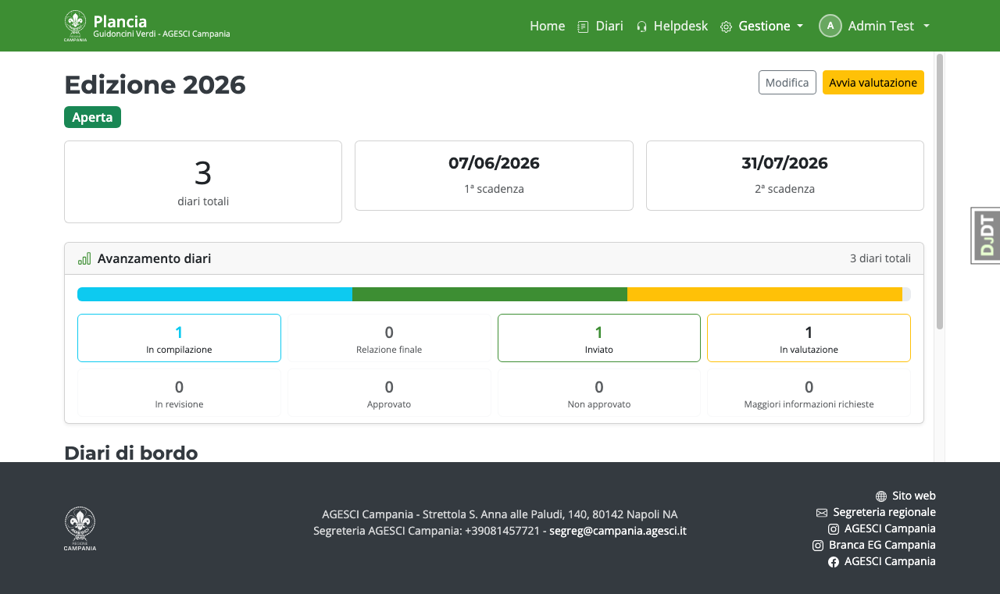
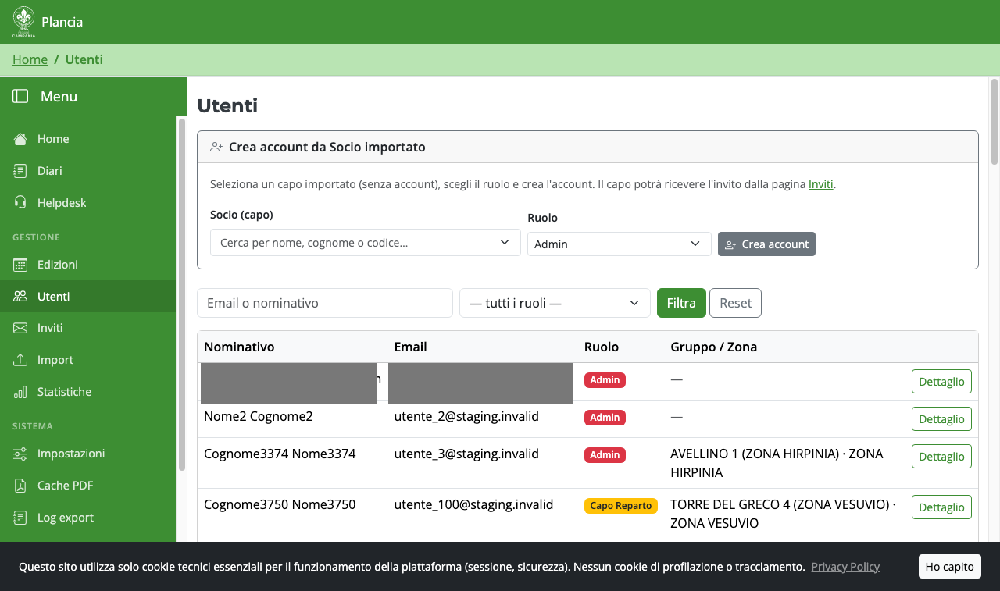

# Guida — Amministratore

L'Admin ha accesso completo alla piattaforma: crea altri Admin e Segreteria, configura
l'autenticazione, gestisce le edizioni e supervisiona tutto il sistema.

> L'Admin deve configurare l'**autenticazione a due fattori (MFA)** al primo accesso.

---

## Home page e lista utenti



Da **Gestione → Utenti** l'Admin vede tutti gli utenti inclusi gli altri Admin.



---

## Pannello Django Admin

Da **Gestione → Pannello admin** (`/admin/`) è possibile accedere all'interfaccia Django
per operazioni di basso livello su qualsiasi modello del database.
Usalo solo per operazioni di emergenza o debug che non sono esposte nell'UI normale.

---

## Configurazione autenticazione a due fattori (MFA)

Al primo accesso la piattaforma richiede di configurare un'app authenticator TOTP
(Google Authenticator, Aegis, Authy, ecc.).

1. Scansiona il QR code mostrato con la tua app authenticator.
2. Inserisci il codice a 6 cifre generato per confermare.
3. Salva i **codici di recupero** in un posto sicuro: servono se perdi l'accesso all'app.

La pagina **Sicurezza (MFA)** nel menu utente (in alto a destra) permette di
gestire i dispositivi TOTP e rigenerare i codici di recupero.

---

## Configurazione autenticazione social (Google, Microsoft, Apple)

Per abilitare i pulsanti "Accedi con Google / Microsoft / Apple" nella pagina di login
segui la guida completa: **[`docs/guide/social_auth.md`](../guide/social_auth.md)**

In sintesi:

1. **Ottieni le credenziali OAuth** dal provider (Google Cloud Console, portale Azure,
   Apple Developer Program) — vedi §4 della guida.
2. **Imposta le variabili d'ambiente** nel file `.env.prod`:
   ```bash
   SOCIAL_GOOGLE_CLIENT_ID=xxxxx.apps.googleusercontent.com
   SOCIAL_GOOGLE_CLIENT_SECRET=GOCSPX-xxxxx
   # Opzionale:
   SOCIAL_MICROSOFT_CLIENT_ID=...
   SOCIAL_MICROSOFT_CLIENT_SECRET=...
   ```
3. **Aggiorna il record Sites** con il dominio di produzione:
   ```bash
   uv run python manage.py shell -c "
   from django.contrib.sites.models import Site
   s = Site.objects.get(pk=1)
   s.domain = 'plancia.agescicampania.org'
   s.name = 'Plancia'
   s.save()
   "
   ```
4. Riavvia l'applicazione. I pulsanti social appaiono automaticamente nel login
   solo se la variabile `CLIENT_ID` del provider è valorizzata.

> Il social login **non crea nuovi utenti da solo**: l'email del provider deve corrispondere
> a un account già esistente in piattaforma (creato tramite invito da Segreteria/Admin).

---

## Configurazione Google Drive OAuth

Plancia può caricare automaticamente PDF e file Excel su **Google Drive** al termine
dell'archiviazione di un'edizione. Richiede un'applicazione OAuth separata da quella
del social login.

### Perché due applicazioni Google OAuth?

| Scopo | Variabili env | Scope richiesti |
|---|---|---|
| **Social login** (accedi con Google) | `SOCIAL_GOOGLE_CLIENT_ID/SECRET` | `email`, `profile`, `openid` |
| **Google Drive** (upload file) | `GOOGLE_OAUTH_CLIENT_ID/SECRET` | `drive` (lettura/scrittura Drive) |

Le due app possono usare lo stesso progetto Google Cloud ma devono avere **credenziali OAuth
separate** perché i permessi (scope) sono diversi.

### Passo 1 — Crea le credenziali OAuth per Drive

1. Vai su [console.cloud.google.com](https://console.cloud.google.com) → seleziona
   il progetto già usato per il social login (o creane uno dedicato).
2. **API e servizi** → **Libreria** → cerca **Google Drive API** → **Abilita**.
3. **API e servizi** → **Credenziali** → **Crea credenziali** → **ID client OAuth 2.0**:
   - Tipo applicazione: **Applicazione web**
   - Nome: `Plancia Drive`
   - **URI di reindirizzamento autorizzati**:
     - Dev: `http://localhost:8000/drive/oauth/callback/`
     - Produzione: `https://plancia.agescicampania.org/drive/oauth/callback/`
4. Copia **ID client** e **Secret client**.

### Passo 2 — Imposta le variabili d'ambiente

Nel file `.env.prod` (o `.env.dev` per il test locale):

```bash
GOOGLE_OAUTH_CLIENT_ID=xxxxx.apps.googleusercontent.com
GOOGLE_OAUTH_CLIENT_SECRET=GOCSPX-xxxxx
GOOGLE_OAUTH_REDIRECT_URI=https://plancia.agescicampania.org/drive/oauth/callback/
```

In dev la redirect URI può essere `http://` — la piattaforma imposta automaticamente
`OAUTHLIB_INSECURE_TRANSPORT=1` solo nel callback di sviluppo.

### Passo 3 — Collega un account Drive a un'edizione

Il flusso OAuth Drive non è globale ma **per edizione**: ogni edizione può usare un
account Google Drive diverso.

1. Vai su **Gestione → Elenco edizioni** → clicca sull'edizione da configurare.
2. Nel pannello **Google Drive** clicca **Collega account Drive**.
3. Vieni reindirizzato a Google per autorizzare l'accesso a Drive
   con l'account Google che contiene le cartelle dell'edizione.
4. Dopo il consenso torni alla pagina dell'edizione con l'email dell'account collegato.
5. Usando il **folder picker** puoi selezionare (o creare) le cartelle:
   - **Cartella allegati**: dove vengono caricate le foto delle imprese
   - **Cartella output**: dove vengono depositati PDF e Excel al momento dell'archiviazione

### Passo 4 — Test dell'upload

Dopo aver collegato l'account, puoi verificare il funzionamento generando un PDF
di prova da un diario completato e controllando che compaia nella cartella Drive configurata.

### Note di sicurezza

- Le credenziali OAuth Drive (access token + refresh token) sono memorizzate nella tabella
  `storage_drive_drivecredenziali` del database. Il database è cifrato a riposo in produzione.
- Un refresh token scade se l'app Google non viene usata per 6 mesi o se l'utente
  revoca l'accesso dal proprio account Google. In quel caso basta ripetere il flusso
  di collegamento (passo 3).
- Lo scope richiesto è `https://www.googleapis.com/auth/drive` (accesso completo al
  Drive dell'account autorizzato). Considera di usare un account Google dedicato
  (es. `archivio@agescicampania.it`) per limitare l'esposizione dei file personali.

---

## Archiviazione di un'edizione

Al termine dell'edizione:

```bash
# Genera PDF di tutti i diari + Excel esiti e carica su Drive
uv run python manage.py archivia_edizione --edizione 1 --genera

# (Dopo verifica) elimina le foto, marca l'edizione archiviata
uv run python manage.py archivia_edizione --edizione 1 --purga --conferma
```

Il comando `--purga` elimina fisicamente le foto caricate (trattamento dati minori)
mantenendo i link esterni come testo. I PDF e l'Excel rimangono su Drive.

---

## Backup

Il backup notturno è configurato via cron (vedi `deploy/crontab.example`):

```bash
30 2 * * *  cd /srv/plancia && ./deploy/backup.sh >> /var/log/plancia_backup.log 2>&1
```

Il backup include dump PostgreSQL + archivio media/log con retention 30 giorni.

---

## Gestione Inviti e primo accesso utenti

L'Admin ha accesso alla pagina **Gestione Inviti** (stessa della Segreteria).
Vedi la sezione corrispondente nella **[Guida Segreteria](segreteria.md)** per
il dettaglio del flusso inviti Capi Reparto e Capi Squadriglia.

---

## Impersonazione

L'Admin può impersonare qualsiasi utente compresa la Segreteria.
Ogni impersonazione viene registrata nel log di audit.
La Segreteria non può impersonare l'Admin.
