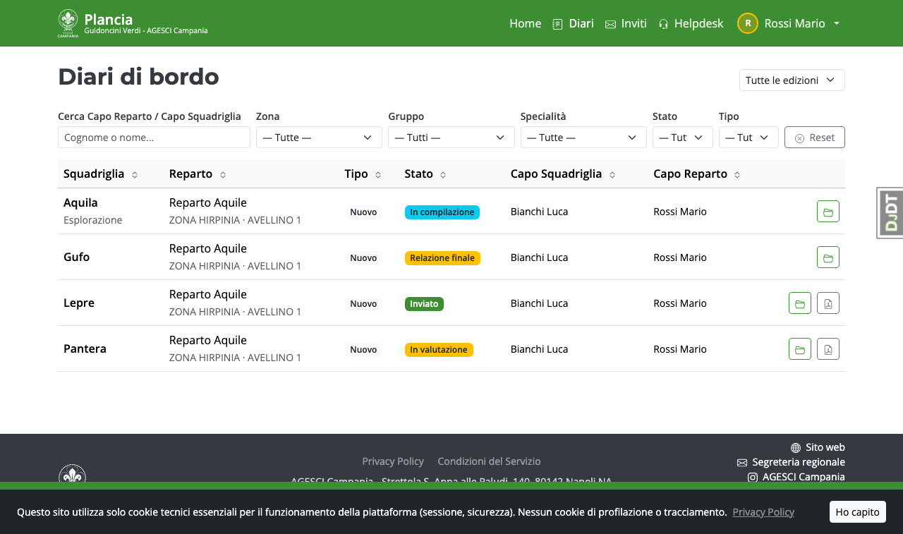
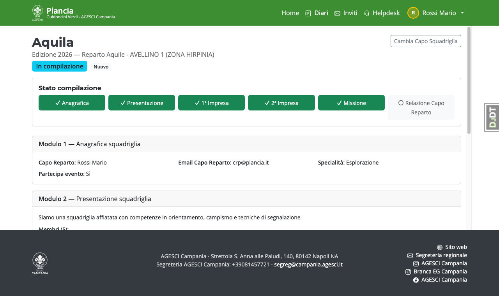
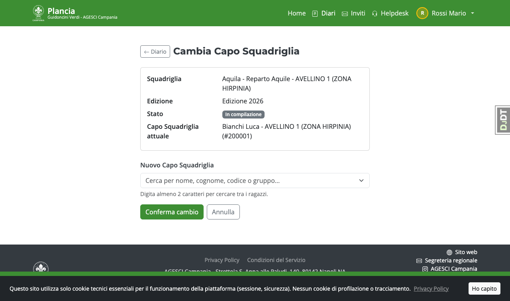

# Guida — Capo Reparto

Il Capo Reparto può leggere tutti i moduli del diario della propria squadriglia
e ha l'esclusiva per compilare il **Modulo 6 — Relazione finale**, che non è mai visibile al Capo Squadriglia.

---

## Primo accesso alla piattaforma

La Segreteria regionale ti invierà un'email con un link personale di attivazione.
Clicca il link e accedi: non ti viene chiesto nulla di aggiuntivo.
Da questo momento puoi impostare la password dal menu in alto a destra → **Profilo**.

> Per i ruoli di Capo Reparto, Pattuglia GV, Segreteria e Incaricato EG le email
> sono verificate dalla piattaforma AGESCI: l'invito arriverà alla tua email ufficiale.

---

## Distribuire i link di accesso ai tuoi Capi Squadriglia

Quando la Segreteria avvia l'invio degli inviti ai Capi Squadriglia, riceverai
un'**email riepilogativa** con una tabella che elenca tutti i tuoi Capi Squadriglia
e il loro link di accesso personale.

**Il tuo compito è consegnare a ciascuno il proprio link.** Puoi farlo:

- Di persona al prossimo incontro di reparto (il modo più sicuro)
- Via chat o messaggio diretto
- Stampando e ritagliando la tabella dalla email

Ogni Capo Squadriglia aprirà il link e inserirà il proprio **codice socio AGESCI**
(il numero sulla tessera) e la propria email. Questo passaggio garantisce che l'account
sia davvero attivato dalla persona giusta.

> **Link perso?** Se un Capo Squadriglia non riesce ad attivare l'account, la Segreteria
> può inviare un nuovo link dalla pagina **Gestione Inviti**. Segnalalo prima possibile
> per non rallentare la compilazione del Diario di Bordo.

---

## Home page

La home mostra l'edizione attiva e il riepilogo dei diari del tuo reparto.

---

## Lista diari

Dalla voce **Diari** nella barra di navigazione vedi tutti i diari delle squadriglie
del tuo reparto, con lo stato attuale di ciascuno.

---

## Dettaglio diario

Cliccando su un diario accedi al dettaglio, dove trovi lo stato di compilazione
di ogni modulo e le azioni disponibili in base allo stato corrente.

---

## Cambia il Capo Squadriglia

Se un Capo Squadriglia deve essere sostituito (es. abbandona la squadriglia),
puoi aggiornare il referente direttamente dalla pagina del diario,
finché il diario non è ancora stato inviato al Capo Reparto (stato *In compilazione*).

1. Apri il **dettaglio del diario** dalla home o dalla lista diari del tuo reparto.
2. Clicca il pulsante **"Cambia Capo Squadriglia"** (visibile solo quando il diario è
   in stato *In compilazione*).
3. Cerca il nuovo Capo Squadriglia per nome, cognome o codice socio nel campo di ricerca.
4. Selezionalo e clicca **"Salva"**.

Il diario viene aggiornato immediatamente. Il precedente Capo Squadriglia perde l'accesso
al diario; il nuovo lo vede dalla propria home page.

> **Attenzione**: il pulsante non compare se il diario è già nello stato *Relazione finale*
> o successivi. In quel caso contatta la Segreteria.

---

## Modulo 6 — Relazione finale

Accessibile **solo dopo** che il Capo Squadriglia ha cliccato "Invia al Capo Reparto"
(il diario si trova nello stato *Relazione finale*). Finché il Capo Squadriglia non ha inviato
la propria parte, il modulo 6 risulta bloccato.

Compila:

- **Sintesi 1ª impresa** — percorso fatto dalla squadriglia (oggetto, tempi, luoghi, obiettivi raggiunti, eventuali problematiche)
- **Sintesi 2ª impresa** — come sopra, se presente
- **Sintesi missione** — percorso durante la missione, se presente
- **Considerazioni finali** — le competenze acquisite hanno avuto ricaduta concreta? I membri hanno conquistato specialità/brevetti?
- **Ritieni che la specialità di squadriglia sia stata conquistata?** — Sì / No / Non ancora deciso

I campi hanno suggerimenti (tooltip ⓘ) che guidano la compilazione.

> Questo modulo è riservato. Il Capo Squadriglia non può vederlo né accedervi in nessuna circostanza.

> Puoi eliminare le foto allegate alle imprese e alla missione finché non hai ancora inviato il diario allo staff.

---

## Invio del diario allo staff

Dopo aver compilato la relazione finale, clicca il pulsante **"Invia diario allo staff"**.
Il diario passa in stato *Inviato* e da questo momento non è più modificabile
(salvo riapertura autorizzata dallo staff).

---

## Scarica il PDF del diario

Dalla pagina di dettaglio del diario (in stato *Inviato* o successivo) è disponibile
il pulsante **"Scarica PDF"**. Il PDF include:

- **Moduli 1–5** compilati dal Capo Squadriglia (anagrafica, presentazione, imprese, missione)
- **Relazione finale** compilata dal Capo Reparto (modulo 6)

La generazione del PDF avviene in background tramite un task asincrono: al termine ricevi
una mail con il link per scaricarlo. Se il PDF è già stato generato in precedenza,
viene scaricato direttamente dalla cache su Drive — il browser avvia il download
automaticamente senza aprire il file nella scheda corrente. Ogni rigenerazione sostituisce il
file precedente su Drive (la cartella di output mantiene sempre una sola versione).

> Il Capo Squadriglia **non ha accesso al PDF** — il documento è destinato al Capo Reparto,
> alla Pattuglia GV e agli Incaricati EG. L'esito della valutazione non compare mai nel PDF.

---

## Visibilità della valutazione

La valutazione della Pattuglia GV e l'esito finale non sono visibili al Capo Reparto fino a quando
l'Incaricato EG non pubblica gli esiti.
