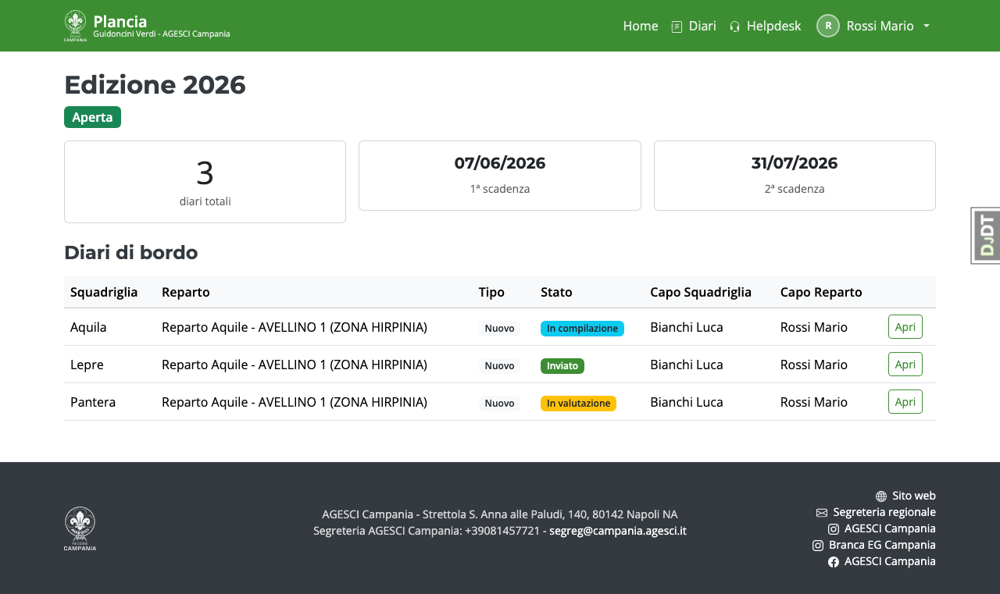
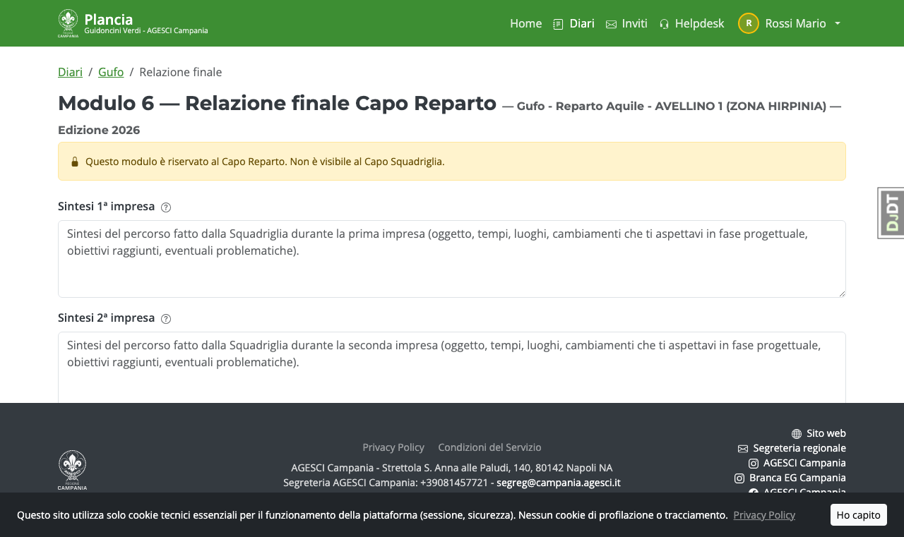

# Guida — Capo Reparto

Il Capo Reparto può leggere tutti i moduli del diario della propria squadriglia
e ha l'esclusiva per compilare il **Modulo 6 — Relazione finale**, che non è mai visibile al Capo Squadriglia.

---

## Home page

La home mostra l'edizione attiva e il riepilogo dei diari del tuo reparto.

---

## Modulo 6 — Relazione finale

Accessibile **solo dopo** che il Capo Squadriglia ha cliccato "Invia al Capo Reparto"
(il diario si trova nello stato *Relazione finale*). Finché il Capo Squadriglia non ha inviato
la propria parte, il modulo 6 risulta bloccato.

Compila:

- **Sintesi 1ª impresa** — lettura del lavoro svolto
- **Sintesi 2ª impresa** — se presente
- **Sintesi missione**
- **Considerazioni finali** — valutazione complessiva del cammino della squadriglia
- **Specialità conquistata** — Sì / No / Non ancora deciso

> Questo modulo è riservato. Il Capo Squadriglia non può vederlo né accedervi in nessuna circostanza.

---

## Invio del diario allo staff

Dopo aver compilato la relazione finale, clicca il pulsante **"Invia diario allo staff"**.
Il diario passa in stato *Inviato* e da questo momento non è più modificabile
(salvo riapertura autorizzata dallo staff).

---

## Visibilità della valutazione

La valutazione della Pattuglia GV e l'esito finale non sono visibili al Capo Reparto fino a quando
l'Incaricato EG non pubblica gli esiti.
