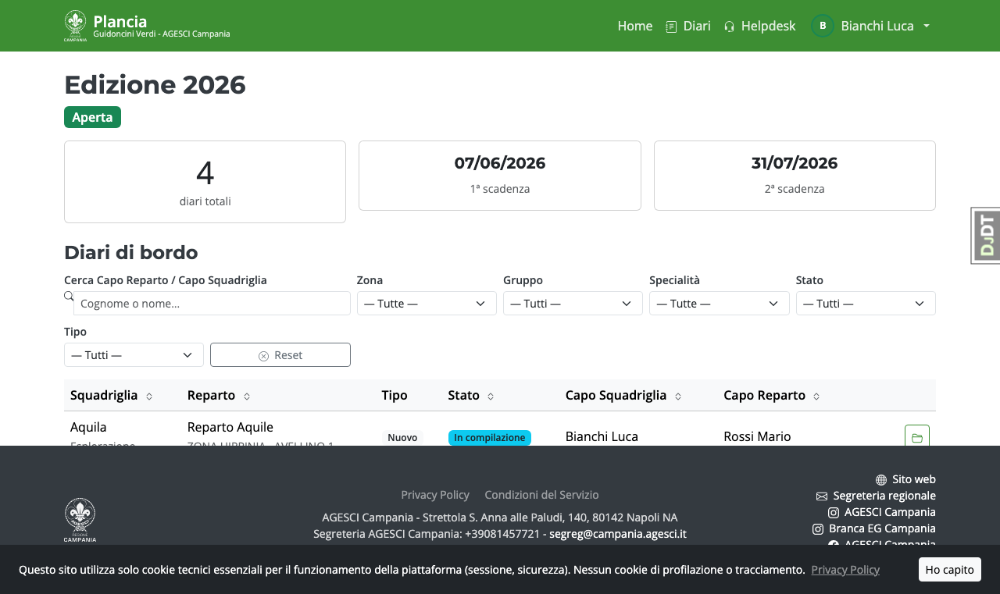
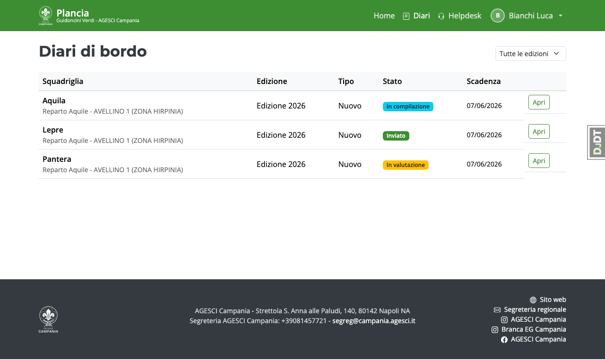
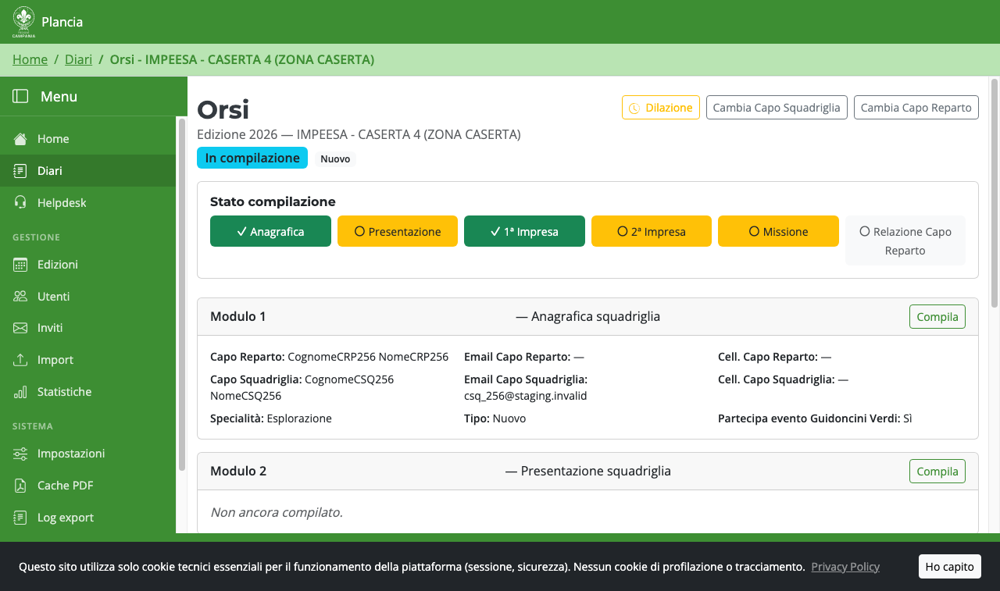
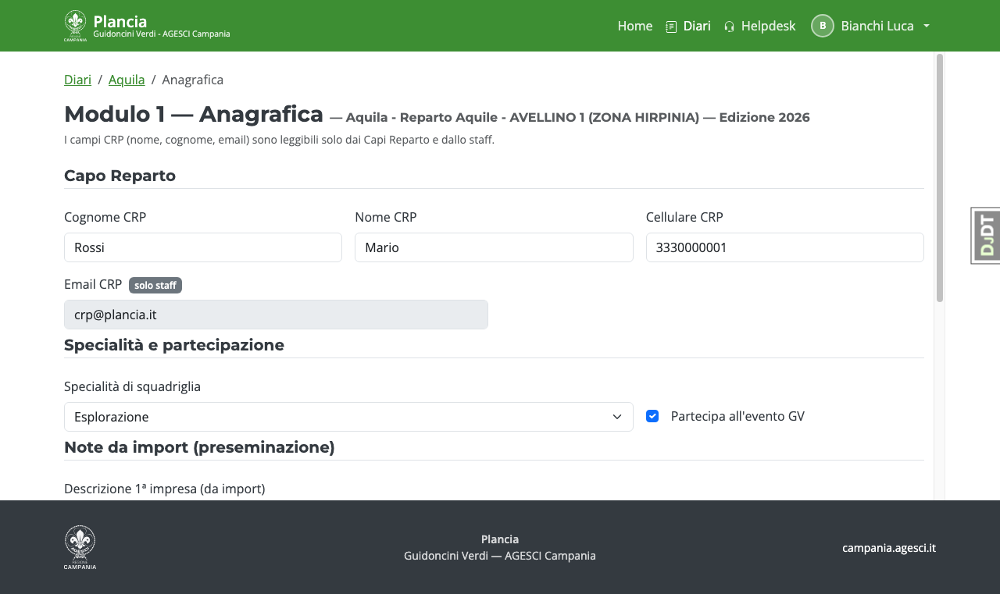
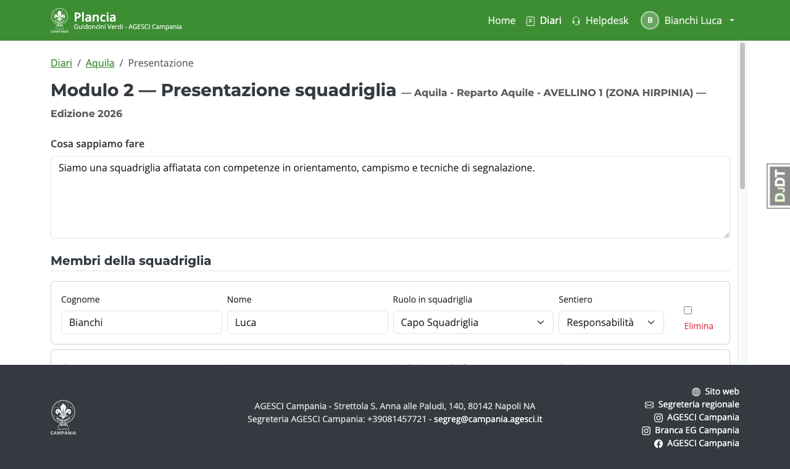
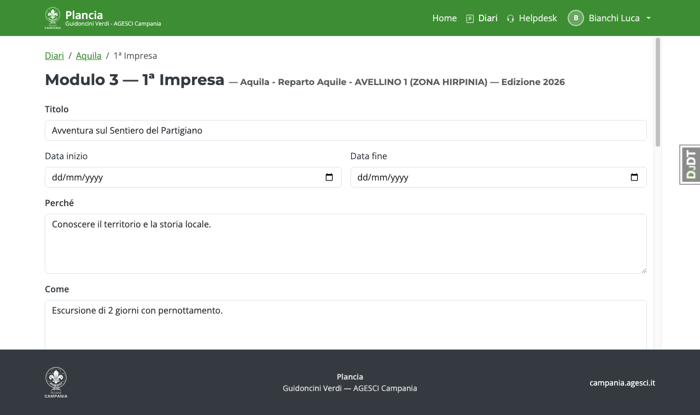
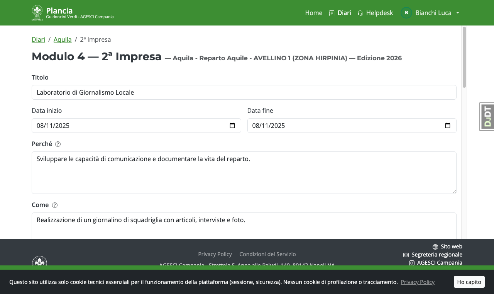
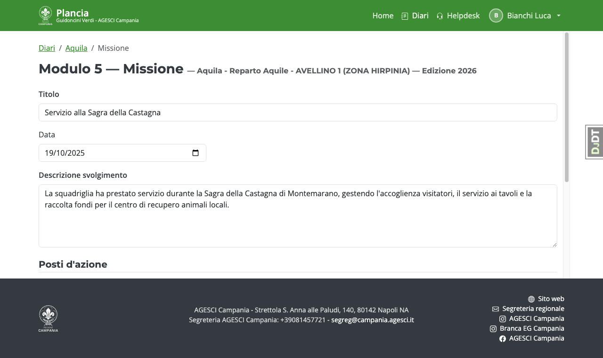

# Guida — Capo Squadriglia

Il Capo Squadriglia è il responsabile della compilazione del Diario di Bordo della propria squadriglia.

---

## Accesso e home page

Dopo il login, la home page mostra l'edizione attiva con un riepilogo dello stato del tuo diario.

---

## Lista diari

Dalla voce **Diari** nella barra di navigazione accedi all'elenco dei diari della tua squadriglia.

---

## Dettaglio diario

La pagina di dettaglio mostra lo stato attuale del diario e lo stato di compilazione di ciascun modulo.
Da qui puoi accedere direttamente ai singoli moduli cliccando sui pulsanti corrispondenti.

Quando tutti i moduli obbligatori sono completati, compare il pulsante **"Invia al Capo Reparto"**.

---

## Modulo 1 — Anagrafica

Inserisci i dati del Capo Reparto di riferimento e seleziona la **specialità di squadriglia** dal menu a tendina (12 specialità ufficiali del regolamento E/G, Allegato 3).

Il campo **Partecipa all'evento GV** indica se la squadriglia sarà presente all'evento finale.

> Le note da import (descrizione imprese, tecniche) vengono precompilate dall'import Evento effettuato dalla Segreteria — sono in sola lettura.

---

## Modulo 2 — Presentazione squadriglia

Descrivi brevemente cosa sa fare la tua squadriglia, poi inserisci l'elenco dei **membri** con:

- **Ruolo**: Capo Squadriglia, Vice Capo Squadriglia, Squadrigliere, Tutti gli altri
- **Sentiero**: Scoperta, Competenza o Responsabilità

---

## Modulo 3 — 1ª Impresa

Compila il titolo, le date e descrivi l'impresa secondo i tre campi:

- **Perché**: motivazione e obiettivi
- **Come**: modalità e attività svolte
- **Cosa**: risultati e prodotti dell'impresa

Aggiungi i **Posti d'azione** della squadriglia per questa impresa.

Nella sezione **Specialità individuali** seleziona le specialità (Allegato 2) che i ragazzi
stanno conquistando con questa impresa, indicando lo stato (**In cammino** / **Conquistata** /
**Non conquistata**). Nella sezione **Brevetti di competenza** fai lo stesso per i brevetti
(Allegato 4).

Puoi allegare **foto** dell'impresa direttamente dalla pagina.

---

## Modulo 4 — 2ª Impresa

Struttura identica al Modulo 3. Per i diari di tipo **Rinnovo** questo modulo è facoltativo
ma sempre compilabile.

---

## Modulo 5 — Missione

Inserisci il titolo, la data e la descrizione dello svolgimento della missione.
Aggiungi i **Posti d'azione** della squadriglia durante la missione.
Puoi allegare foto anche qui.

---

## Inviare la propria parte al Capo Reparto

Quando tutti i moduli obbligatori sono completi, nel dettaglio del diario compare il pulsante
**"Invia al Capo Reparto"**. Cliccandolo il diario passa in stato *Relazione finale* e il Capo
Reparto può compilare il modulo 6.

Da questo momento i tuoi moduli non sono più modificabili (salvo riapertura autorizzata dallo staff).

---

## Autosave e modalità offline

Ogni modulo salva automaticamente i dati nel browser ogni pochi secondi.
Se perdi la connessione, un banner rosso in basso ti avvisa; i dati rimangono
nel browser e vengono salvati sul server quando torni online.
