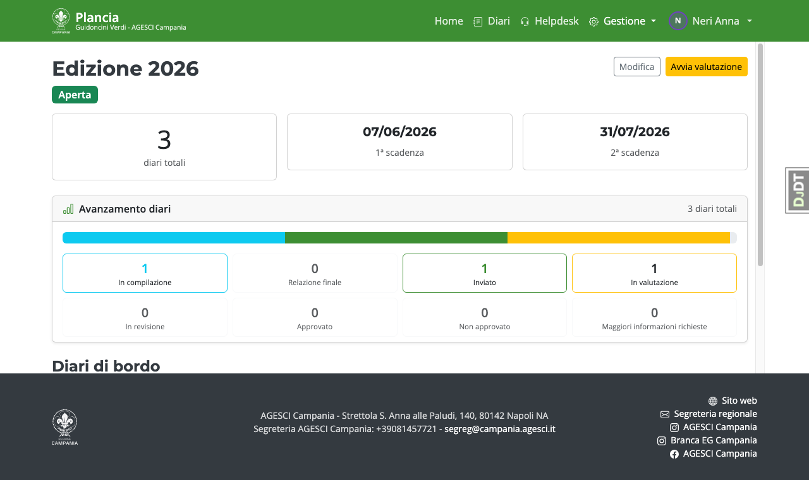
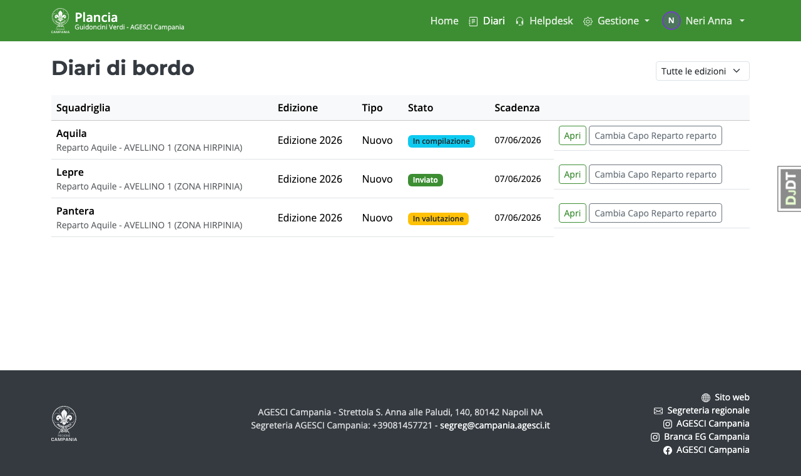
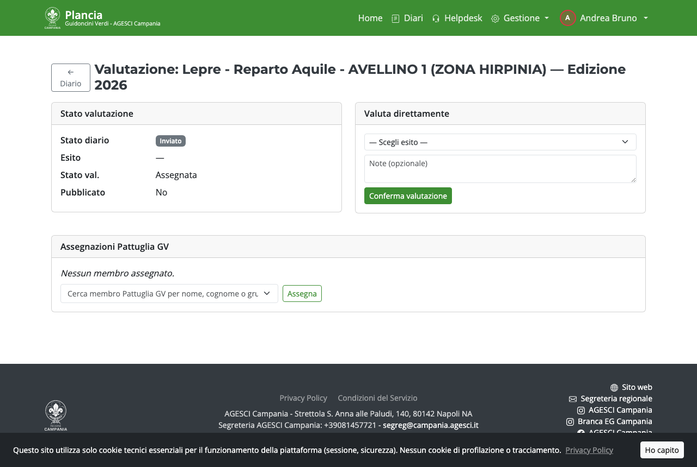
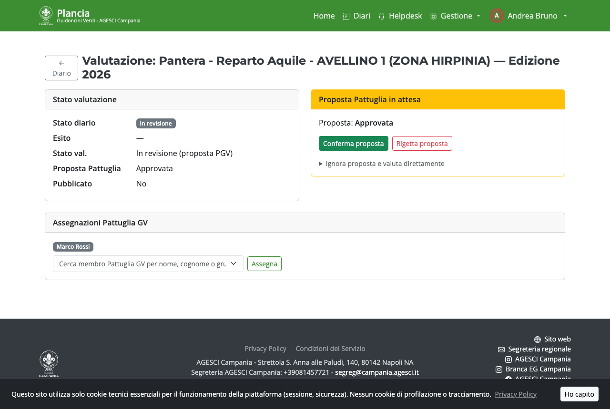

# Guida — Incaricato EG

L'Incaricato EG supervisiona l'intera valutazione: può valutare direttamente o coinvolgere
la Pattuglia GV, confermare o modificare le proposte e pubblicare gli esiti ufficiali.

> L'Incaricato EG deve configurare l'**autenticazione a due fattori (MFA)** al primo accesso.

---

## Flussi di valutazione

Per ogni diario l'Incaricato sceglie caso per caso il flusso più adatto:

**Flusso diretto** (senza Pattuglia GV):
```
Diario inviato → Valutazione Incaricato → Pubblicazione
```

**Flusso con Pattuglia GV**:
```
Diario inviato → Assegnazione PGV → Proposta PGV → Revisione Incaricato → Pubblicazione
```

Entrambi i flussi sono disponibili contemporaneamente su ogni diario e non richiedono
configurazioni preventive.

---

## Home page

La home mostra l'edizione in corso, il numero di diari inviati in attesa di valutazione
e lo stato complessivo delle assegnazioni.




---

## Lista diari

Dalla voce **Diari** accedi all'elenco completo dei diari di tutte le squadriglie,
con il loro stato attuale (Inviato, In valutazione, Approvato, ecc.).




---

## Valutazione diretta

Per valutare direttamente (senza coinvolgere la Pattuglia GV), entra nel dettaglio
di valutazione del diario (`Gestione → Valutazione`) e compila il modulo
**Valuta direttamente**: scegli l'esito e aggiungi eventuali note.

Il form è disponibile anche quando il diario è ancora in stato *Inviato*: il sistema
avvia automaticamente la fase di valutazione al momento della conferma.



---

## Flusso con Pattuglia GV

### Assegnazione

Usa il campo **Assegnazioni Pattuglia GV** nella pagina di valutazione per scegliere
il membro della pattuglia che valuterà il diario. Puoi assegnare più membri.

### Proposta in revisione

Quando la PGV inserisce una proposta *Approvata* o *Non approvata*, il diario entra
in stato **In revisione**. Nella pagina di valutazione compare la card gialla
**Proposta Pattuglia in attesa** con i pulsanti **Conferma proposta** e **Rigetta proposta**.

Se preferisci sovrascrivere la proposta e valutare direttamente, espandi la sezione
*Ignora proposta e valuta direttamente* nella stessa card.



---

## Pubblicazione

Puoi pubblicare i diari individualmente o in blocco (tutti o per scadenza).
La pubblicazione rende visibile la valutazione al Capo Squadriglia e al Capo Reparto.

> Dopo la pubblicazione non è più possibile modificare l'esito, salvo riapertura esplicita
> (consentita solo se siamo ancora nella prima scadenza e la seconda non è ancora passata).

---

## Riapertura per integrazioni

Se un diario è stato valutato sulla prima scadenza e la seconda scadenza non è ancora passata,
l'Incaricato può riaprirlo per permettere al Capo Squadriglia di integrare il materiale.

---

## Statistiche

Dalla voce **Gestione → Statistiche** hai una panoramica degli esiti per zona,
dei tempi di valutazione e del numero di ticket helpdesk aperti.
