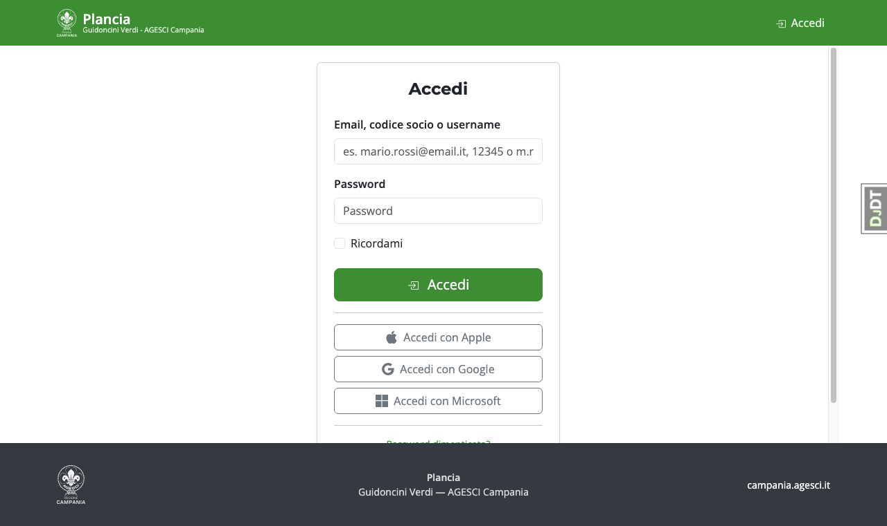

# Manuale d'uso — Plancia

**Piattaforma Guidoncini Verdi · AGESCI Campania**

Plancia è la piattaforma web per la gestione del concorso Guidoncini Verdi della Branca E/G.
Permette alle squadriglie di compilare il Diario di Bordo, ai Capi Reparto di integrarlo, alla
Pattuglia Guidoncini Verdi di valutarlo e alla Segreteria di amministrare l'intera edizione.

---

## Guida per ruolo

| Ruolo | Funzione principale |
|---|---|
| [Capo Squadriglia](csq.md) | Compila i moduli del Diario di Bordo |
| [Capo Reparto](crp.md) | Integra il diario con la Relazione finale |
| [Pattuglia Guidoncini Verdi](pgv.md) | Valuta i diari assegnati |
| [Incaricato EG](incaricato.md) | Supervisiona le valutazioni e pubblica gli esiti |
| [Segreteria](segreteria.md) | Gestisce utenti, edizioni e import |
| [Amministratore](admin.md) | Configura la piattaforma, OAuth e autenticazione social |

---

## Struttura del Diario di Bordo

Il Diario è composto da sei moduli e segue un flusso a due fasi:

| Modulo | Titolo | Chi compila |
|---|---|---|
| 1 | Anagrafica | Capo Squadriglia / Capo Reparto |
| 2 | Presentazione squadriglia | Capo Squadriglia |
| 3 | 1ª Impresa | Capo Squadriglia |
| 4 | 2ª Impresa *(Rinnovo: facoltativo)* | Capo Squadriglia |
| 5 | Missione | Capo Squadriglia |
| 6 | Relazione finale | Capo Reparto *(mai visibile al Capo Squadriglia)* |

### Flusso di compilazione

1. Il **Capo Squadriglia** compila i moduli 1–5 e clicca **"Invia al Capo Reparto"** quando ha finito.
2. Il diario passa in stato **Relazione finale**: il **Capo Reparto** può ora compilare il modulo 6.
3. Il Capo Reparto clicca **"Invia diario allo staff"** per consegnare il diario completo.
4. Da questo momento il diario è in stato **Inviato** e non è più modificabile (salvo riapertura autorizzata).

---

## Accesso alla piattaforma

L'URL della piattaforma viene comunicato dalla Segreteria regionale.

| Ruolo | Come si accede la prima volta |
|---|---|
| Admin, Segreteria, Incaricato EG, PGV, Capo Reparto | Email di invito con link di attivazione diretto |
| Capo Squadriglia | Link consegnato dal proprio Capo Reparto + conferma codice socio AGESCI e email |

Dopo l'attivazione si accede con email e password, oppure con i pulsanti
**Accedi con Google / Microsoft / Apple** se configurati dall'Admin, oppure con una
**passkey** (Face ID, Touch ID, Windows Hello) se precedentemente registrata.

Gli utenti con ruolo Admin, Segreteria o Incaricato EG devono configurare
l'**autenticazione a due fattori (MFA)** al primo accesso tramite un'app
authenticator (Google Authenticator, Aegis, ecc.).

---

## Installazione come app (PWA)

Plancia può essere installata sul tuo dispositivo come un'app, senza passare dall'App Store.

**Su Android (Chrome):** alla prima visita compare un banner verde in fondo alla pagina —
clicca **"Installa"** per aggiungerla alla schermata Home.

**Su iPhone / iPad (Safari):** tocca il pulsante **Condividi** (□↑) in basso, poi
**"Aggiungi a Home"**. Il banner informativo in pagina ricorda questa procedura.

Una volta installata, tieni premuto l'icona: compariranno i collegamenti rapidi a
**Diari**, **Valutazioni** e **Helpdesk**.

---

## Note sulla modalità offline (PWA)

Plancia funziona anche senza connessione. Se vai offline mentre compili un modulo:

- I dati inseriti vengono **salvati automaticamente** nel browser (ogni pochi secondi).
- Le foto selezionate vengono **accodate localmente** e mostrate con il badge "In attesa".
- Al ritorno della connessione, testi e foto vengono sincronizzati in automatico.
- Un banner colorato segnala lo stato della connessione; un badge nell'intestazione mostra
  il numero di foto ancora in attesa di sincronizzazione.

**Sessione scaduta offline**: se la sessione scade mentre si è offline, la coda non viene
persa — compare un banner "Hai modifiche in attesa, accedi per sincronizzare". Al login
successivo il sync riparte automaticamente.

> **Nota**: le pagine di login (`/accounts/`) richiedono sempre la rete — non vengono mai
> servite dalla cache offline, per garantire un token di sicurezza (CSRF) sempre aggiornato.
