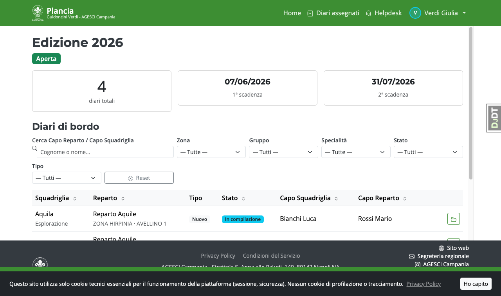
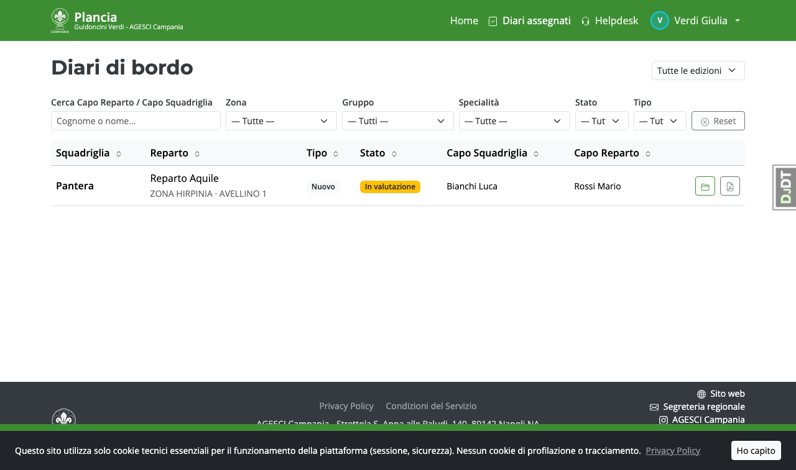

# Guida — Pattuglia Guidoncini Verdi

I membri della Pattuglia GV valutano i diari che vengono loro assegnati dall'Incaricato EG.

---

## Home page

La home mostra l'edizione in corso e il numero di diari assegnati da valutare.

---

## Lista diari assegnati

Dalla voce **Diari assegnati** puoi vedere solo i diari che ti sono stati assegnati.

---

## Valutazione di un diario

Entrando nel dettaglio di un diario assegnato puoi:

1. Leggere tutti i moduli compilati dal Capo Squadriglia (1–5) e la relazione del Capo Reparto (modulo 6).
2. Aprire la scheda **Valutazione** per inserire la tua proposta:
   - **Approvato**, **Non approvato** o **Maggiori informazioni richieste**
   - Un campo note per motivare la decisione

La tua proposta va all'Incaricato EG che la conferma o la modifica prima della pubblicazione.

> Non puoi vedere la valutazione degli altri membri della Pattuglia sullo stesso diario,
> né ri-delegare la valutazione a un altro membro.

---

## Note importanti

- Puoi **proporre** un esito ma non **pubblicarlo**: la pubblicazione è riservata all'Incaricato EG.
- Se proponi *Approvato* o *Non approvato*, il diario entra in stato **In revisione** e l'Incaricato
  EG deve confermare prima della pubblicazione.
- Se proponi *Maggiori informazioni richieste*, il diario torna al Capo Squadriglia per integrazioni
  senza passare dalla revisione.
