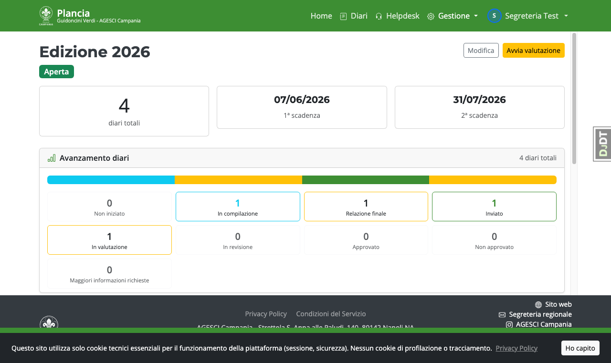
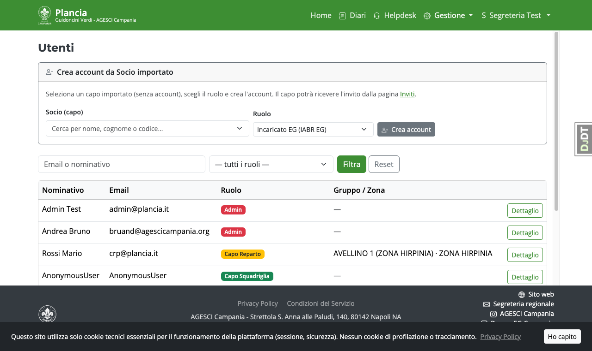
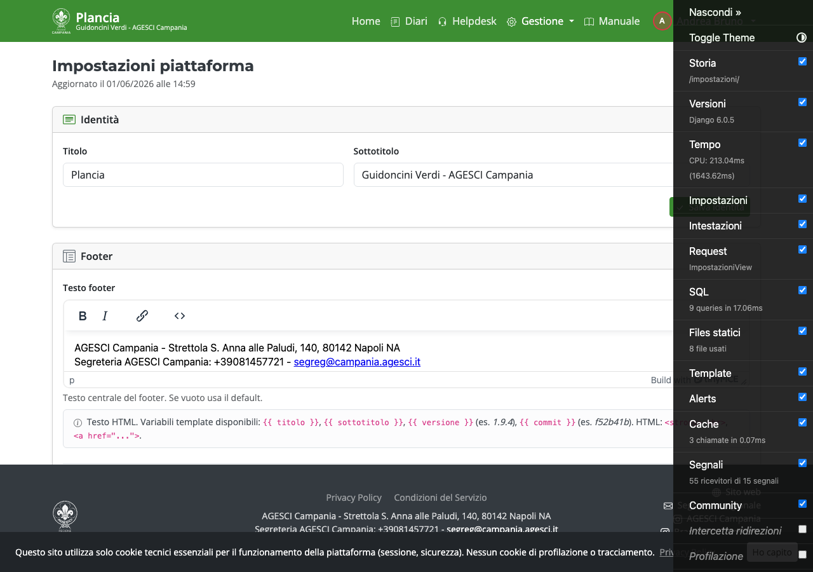
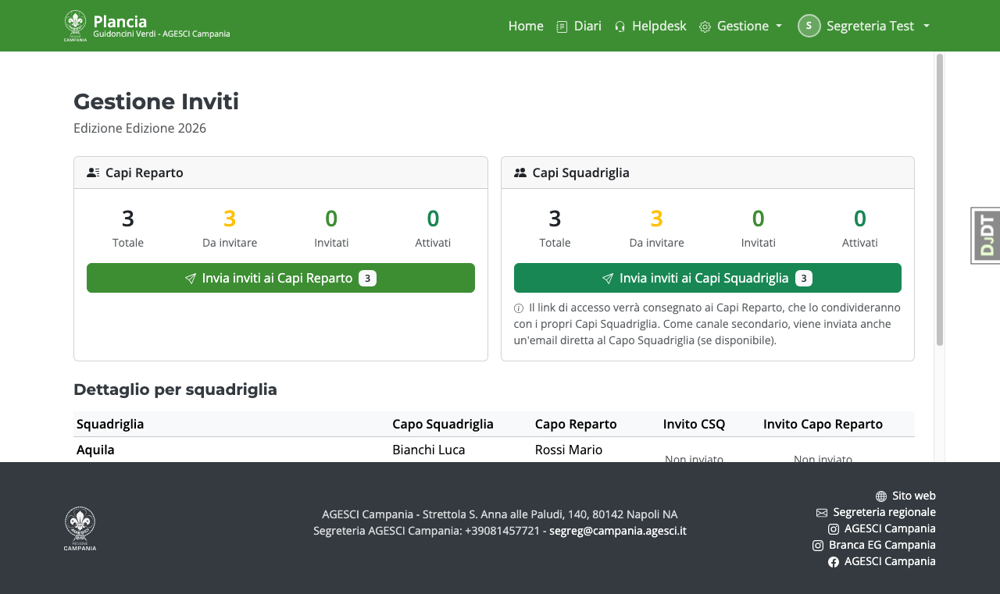
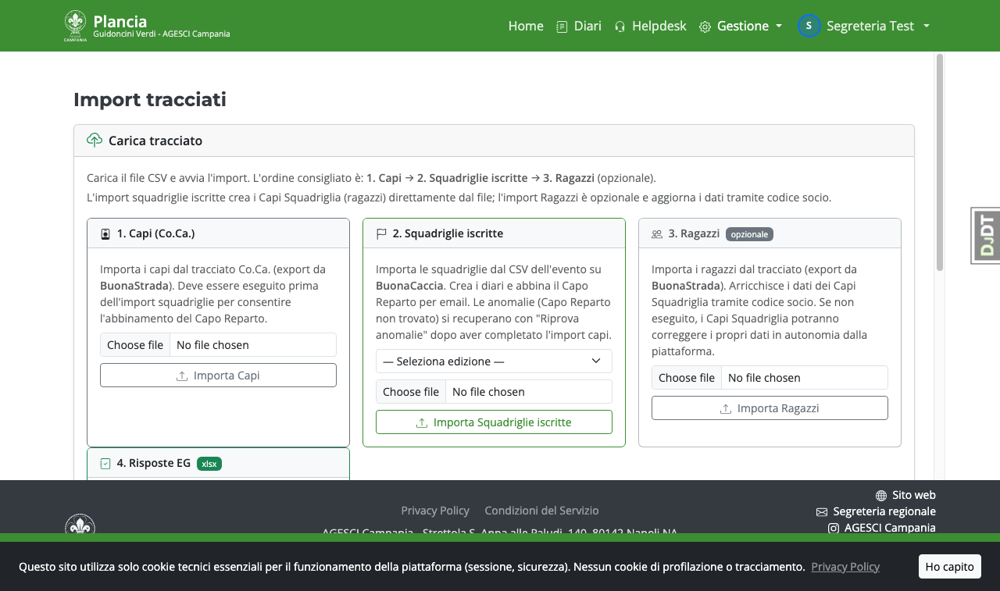
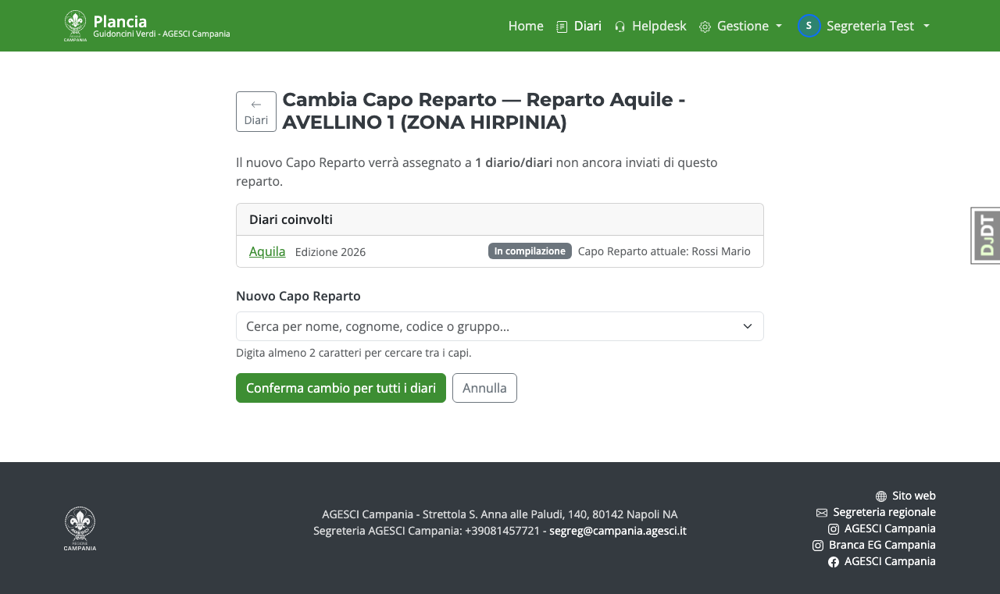

# Guida — Segreteria

La Segreteria gestisce gli utenti, le edizioni, gli import delle anagrafiche e le impostazioni
operative della piattaforma.

> La Segreteria deve configurare l'**autenticazione a due fattori (MFA)** al primo accesso.

---

## Home page

La home mostra l'edizione attiva con lo stato complessivo dei diari.

---

## Gestione utenti

Da **Gestione → Utenti** trovi l'elenco completo degli utenti della piattaforma.
Puoi filtrare per ruolo e cercare per nome o email.

Per ogni utente puoi:

- Visualizzarne il profilo e il ruolo
- **Assegnare un ruolo** (Nomina): segreteria può creare utenti con ruolo CRP, PGV, CSQ,
  Incaricato EG e altri Segreteria
- Inviare un nuovo invito via email se l'utente non ha ancora attivato l'account

> La Segreteria **non può** creare o modificare account Admin.

---

## Impostazioni di piattaforma

Da **Gestione → Impostazioni** (visibile a Admin e Segreteria):

Le sezioni disponibili:

| Sezione | Cosa configuri |
|---|---|
| **Identità** | Titolo e sottotitolo mostrati nella navbar |
| **Footer** | Testo, etichetta link e URL del footer |
| **Posta elettronica** | Modalità di invio email, SMTP, indirizzo mittente |
| **Stato e diagnostica** | Modalità manutenzione, debug toolbar |
| **Import tracciati** | Avvio manuale degli import Co.Ca., Ragazzi, Evento |
| **Template email** | Personalizzazione in rich text delle email di sistema |

---

## Gestione Inviti

Da **Gestione → Inviti** puoi inviare e monitorare gli inviti per l'edizione attiva.
La pagina mostra contatori e stato (non inviato / inviato / attivato) per ogni squadriglia.

### Sequenza consigliata

1. Esegui gli import (Co.Ca. → Squadriglie) e riconcilia le eventuali anomalie.
2. Clicca **"Invia inviti ai Capi Reparto"**: ogni CRP riceve il proprio link di accesso.
3. Dopo che i CRP hanno attivato l'account (o in parallelo), clicca
   **"Invia inviti ai Capi Squadriglia"**.

### Cosa succede con l'invio ai Capi Squadriglia

- Ogni Capo Reparto riceve un'**email riepilogativa** con la tabella dei propri
  Capi Squadriglia e il loro link personale. Il CRP deve consegnarli ai ragazzi.
- Se il Capo Squadriglia ha un'email nel tracciato, riceve anche un'**email diretta**
  come canale secondario (l'email potrebbe essere errata, quindi non è il canale primario).
- L'attivazione richiede il **codice socio AGESCI** (dalla tessera) + una email:
  questo garantisce che l'account sia attivato dalla persona giusta.

### Reinvio individuale

Dalla tabella della pagina Gestione Inviti puoi reinviare l'invito a un singolo
utente con il pulsante **↺** accanto al suo nome.

---

## Import anagrafiche

Da **Gestione → Import anagrafiche** trovi lo storico di tutti gli import eseguiti.

I tre tipi di import (avviabili da Impostazioni o da riga di comando):

| Comando | Sorgente | Effetto |
|---|---|---|
| `import_coca` | CSV capi Co.Ca. | Crea/aggiorna Soci (categoria capo) |
| `import_ragazzi` | CSV ragazzi | Crea/aggiorna Soci (categoria ragazzo) |
| `import_squadriglie` | CSV Evento | Crea diari, lega CSQ per codice socio e CRP per email |

> I CSV reali non vanno mai caricati nel repository (contengono dati di minori).
> Usa sempre file di test dalla cartella `fixtures/`.

### Capi Reparto non trovati — record provvisori

Se durante l'import squadriglie un Capo Reparto non viene trovato per email
(ad esempio il tracciato Co.Ca. non è ancora stato importato, o l'email è diversa),
la piattaforma crea automaticamente un **Capo Reparto provvisorio** con i dati
disponibili dal tracciato Evento (nome, cognome, email).
Il codice socio è temporaneo (formato `tmpNNNNN`) e sarà sostituito dalla riconciliazione.

Questo garantisce che ogni diario abbia sempre un Capo Reparto associato —
anche prima della riconciliazione — e che i Capi Reparto provvisori possano già
ricevere l'invito e distribuire i link ai loro Capi Squadriglia.

I record provvisori sono identificati dal badge **"Da riconciliare"** nella pagina
Gestione Inviti. Effettua la riconciliazione prima di pubblicare i risultati.

### Riconciliazione manuale

Ogni riga anomala è accessibile dallo storico import. Puoi:

- Cliccare **"Riprova anomalie"** dopo un nuovo import Co.Ca. per abbinare
  automaticamente i CRP ora presenti nel DB.
- Usare il form di riconciliazione manuale per abbinare singole righe cercando
  il Socio capo per nome, cognome o codice socio.

Quando riconcili un CRP provvisorio che ha già attivato l'account, l'account utente
viene trasferito automaticamente al Socio reale senza perdita di dati.

---

## Cambio referenti di un diario

### Cambia il Capo Reparto di un singolo diario

Se un Capo Reparto deve essere sostituito sul singolo diario (es. errore di import
o cambio improvviso), puoi aggiornarlo finché il diario non è stato inviato
(stati *In compilazione* e *Relazione finale*).

1. Apri il **dettaglio del diario**.
2. Clicca il pulsante **"Cambia Capo Reparto"**.
3. Cerca il nuovo Capo Reparto per nome, cognome o codice socio.
4. Selezionalo e clicca **"Salva"**.

### Cambia il Capo Reparto di un intero reparto (bulk)

Utile quando un CRP viene sostituito e ha più diari associati (più squadriglie).

1. Dalla lista diari, individua il reparto interessato e clicca
   **"Cambia Capo Reparto — reparto"** accanto a uno dei diari.
2. La pagina mostra tutti i diari del reparto che possono ancora essere modificati
   (stati *In compilazione* e *Relazione finale*).
3. Cerca il nuovo Capo Reparto e clicca **"Salva"**.
   Tutti i diari elencati vengono aggiornati in un'unica operazione.

> I diari già in stato *Inviato* o successivi **non vengono modificati** dal cambio bulk.
> Per quei diari è necessaria un'operazione manuale tramite il pannello Django Admin.

---

## Gestione edizioni

Da **Gestione → Elenco edizioni** puoi vedere e modificare le edizioni.

Per ogni edizione è possibile:

- Cambiare lo stato (Aperta → In valutazione → Chiusa)
- Impostare le date evento e le scadenze
- Collegare un account Google Drive per l'archiviazione dei file
- Aggiungere dilazioni per specifiche squadriglie

---

## Helpdesk

Dalla voce **Helpdesk** in navbar gestisci i ticket aperti da CSQ e CRP.
Puoi rispondere, prendere in carico e chiudere i ticket.

---

## Impersonazione utenti

La Segreteria può **impersonare** (accedere come) qualunque utente con rango inferiore
(non Admin) tramite il pulsante nella pagina di dettaglio utente.
Durante l'impersonazione appare un banner arancio in cima alla pagina.
Non è possibile impersonare un Admin.
